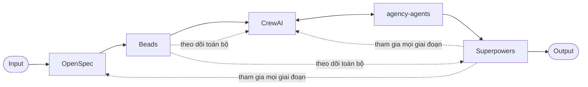

# Hệ thống AI Development hoàn chỉnh

Research hub tổng hợp kiến trúc, tài liệu và ví dụ cho hệ thống phát triển phần mềm bằng AI -- kết hợp 5 thành phần chuyên biệt thành một quy trình thống nhất.

---

## Bản đồ 5 thành phần

| Vai trò | Repo | Analogy | Mô tả |
|---|---|---|---|
| Chuyên môn | **agency-agents** | Bộ não chuyên gia | AI agent prompts chuyên biệt theo lĩnh vực |
| Điều phối | **CrewAI** | Cơ thể | Multi-agent orchestration (sequential/hierarchical), unified memory |
| Quy trình | **OpenSpec** | Quy trình làm việc | Spec-driven development: proposal &rarr; specs &rarr; design &rarr; tasks &rarr; verify &rarr; archive |
| Phương pháp | **Superpowers** | Kỷ luật chuyên nghiệp | 14 skills: brainstorming, planning, TDD, code review, debugging, verification... |
| Lưu vết | **Beads** | Ký ức | Distributed graph issue tracker, audit trail, dependency graph, thống kê |

---

## Sơ đồ kiến trúc



**Ghi chú:**
- **Superpowers** tham gia ở mọi giai đoạn (brainstorming, planning, TDD, code review, debugging, verification).
- **Beads** theo dõi và lưu vết xuyên suốt toàn bộ quy trình.

---

## Quick Start

```bash
# 1. Clone research hub
git clone <research-hub-url> ai-development-system
cd ai-development-system

# 2. Clone 5 repo vào cùng workspace directory
git clone <url>/agency-agents  ../agency-agents
git clone <url>/CrewAI          ../CrewAI
git clone <url>/OpenSpec        ../OpenSpec
git clone <url>/Superpowers     ../Superpowers
git clone <url>/Beads           ../Beads

# 3. Đọc hướng dẫn tích hợp
# Mở docs/integration-guide.md

# 4. Chạy ví dụ đầu tiên
cd examples/01-basic-crew/
# Làm theo README trong thư mục ví dụ
```

---

## Mục lục

| Tài liệu | Mô tả |
|---|---|
| [docs/architecture.md](docs/architecture.md) | Kiến trúc tổng thể |
| [docs/integration-guide.md](docs/integration-guide.md) | Hướng dẫn tích hợp |
| [docs/memory-analysis.md](docs/memory-analysis.md) | Phân tích trí nhớ AI |
| [docs/workflow.md](docs/workflow.md) | Luồng làm việc end-to-end |
| [references/](references/) | Thẻ tham chiếu 5 repo |
| [research/](research/) | Ghi chú nghiên cứu |
| [examples/](examples/) | Code mẫu minh họa |

---

## Yêu cầu hệ thống

| Công cụ | Phiên bản |
|---|---|
| Python | &ge;3.10, &lt;3.14 |
| Node.js | 18+ |
| Go | 1.25+ |
| Git | latest |
