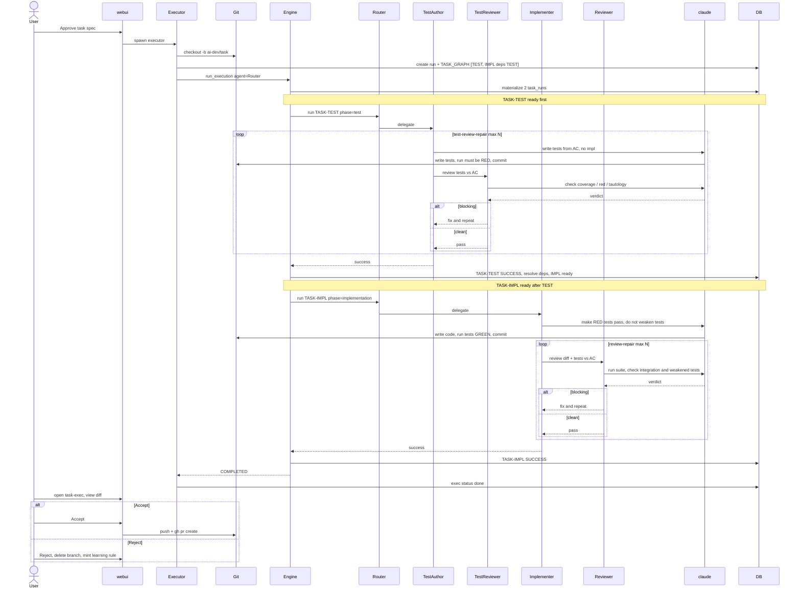

# AI Development System

Hệ thống tự động hóa phát triển phần mềm theo mô hình **Human-as-Approver**: AI tranh luận, lập kế hoạch, và thực thi — con người chỉ duyệt tại các gate quan trọng.

---

## Mô hình hoạt động

```
Ý tưởng thô
    │
    ▼
[AI debate] ──── 2 agent tranh luận mỗi câu hỏi, Moderator tổng hợp
    │
    ▼
[Gate 1] ──────── Bạn duyệt kết quả debate, quyết định ESCALATE items
    │
    ▼
[Build spec] ─── 5 artifact cố định: proposal, design, functional, non-functional, acceptance-criteria
    │
    ▼
[Task graph] ─── AI sinh tasks + dependencies + metadata đầy đủ
    │
    ▼
[Gate 2] ──────── Bạn approve/sửa task graph
    │
    ▼
[Execution] ──── CrewAI thực thi theo dependency order, retry tự động
    │
    ▼
[Gate 3] ──────── Bạn duyệt verification report, quyết định fix/skip/abort
    │
    ▼
COMPLETED
```

**Con người làm:** Duyệt debate report (~5 phút) + Approve task graph (~2 phút) + Review verification (~5 phút)

**AI làm:** Mọi thứ còn lại.

---

## Kiến trúc

```
src/ai_dev_system/
├── normalize.py          # Normalize ý tưởng thô → initial brief
├── debate/               # AI debate engine (agents, rounds, moderator)
├── gate/                 # Gate 1, 2, 3 — approval logic + bridges
├── spec_bundle.py        # Build 5-artifact spec bundle
├── finalize_spec.py      # Finalize spec sau Gate 1
├── task_graph/           # Sinh + validate task graph
├── rules/                # Rule Registry — inject rules vào agent
├── engine/               # Execution engine (worker loop, retry, escalation)
├── agents/               # CrewAI agent wrapper
├── verification/         # LLM judge acceptance criteria
├── beads/                # Beads audit trail sync
├── storage/              # Artifact storage trên disk
├── db/                   # PostgreSQL repos
└── cli/                  # CLI entry points
```

**Skills (Claude Code slash commands):**

| Command | Chức năng |
|---|---|
| `/start-project` | Phase 1a — nhận ý tưởng, chạy debate pipeline |
| `/review-debate` | Gate 1 — duyệt debate report, ghi decision log |
| `/review-verification` | Gate 3 — duyệt verification report, đóng run |

---

## Trạng thái

- **262 tests** (204 unit + 60 integration) — tất cả pass
- Đầy đủ pipeline từ normalize → verification
- PostgreSQL-backed với full audit trail

---

## Bắt đầu

Xem [SETUP.md](SETUP.md) để cài đặt và chạy.
