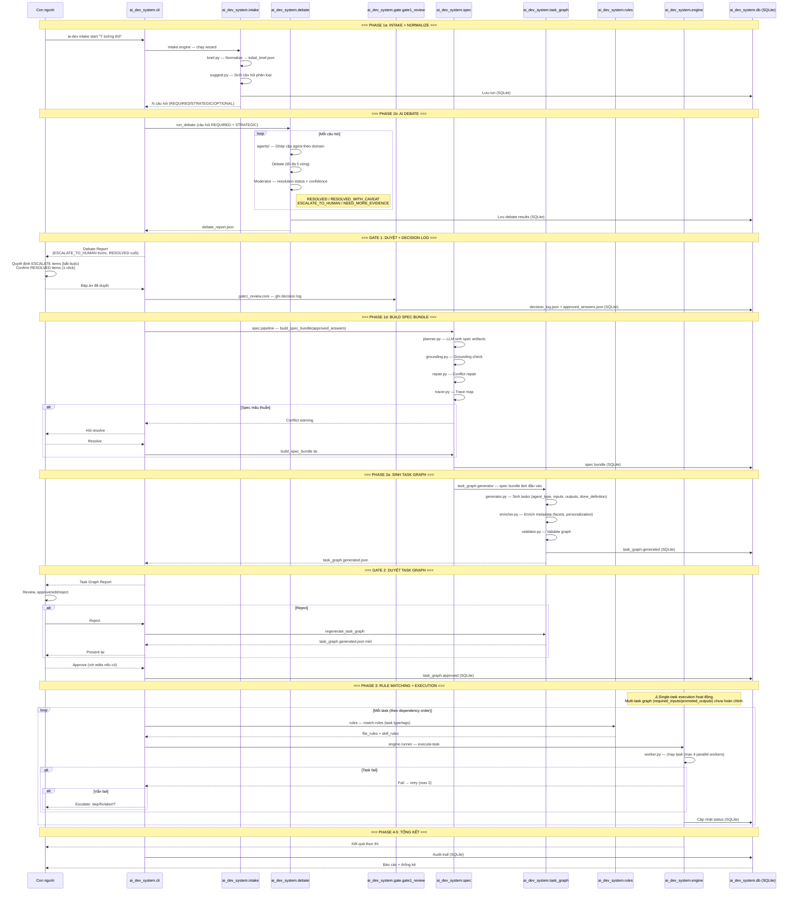

# Luồng dữ liệu v2: Human-as-Approver

Biểu đồ này thể hiện luồng dữ liệu thực tế qua các Python module trong `src/ai_dev_system/`.
Người dùng chỉ xuất hiện tại 2 approval gate thay vì can thiệp từng bước.



## So sánh Data Flow v1 vs v2

### v1: Con người ở giữa mỗi bước

```
U -> intake -> U -> spec -> U -> task_graph -> engine -> U
     hỏi         trả lời      tạo task
```

### v2: Con người chỉ ở 2 approval gates

```
U -> intake -> debate -> [GATE 1 + decision_log] -> spec -> task_graph -> [GATE 2] -> engine -> U
```

## Điểm khác biệt chính

| Bước | v1 Data | v2 Data |
|---|---|---|
| Input | Ý tưởng thô | Ý tưởng thô → normalized brief (`intake.brief`) |
| Brainstorming | User trả lời từng câu | AI debate (`debate` module) → User approve report |
| Quyết định | User tự suy nghĩ | Resolution status → User approve/override + decision log |
| Spec | Free-form | 5 artifact cố định (`spec.pipeline`) |
| Tạo task | User tự tạo thủ công | `task_graph.generator` sinh JSON → User approve |
| Dependency | User tự thiết lập | `task_graph.generator` phân tích → User approve |
| Execution | Không retry | `engine.failure` — retry policy + escalate |
| Persistence | Không có | SQLite (`ai_dev_system.db`) — toàn bộ state |
