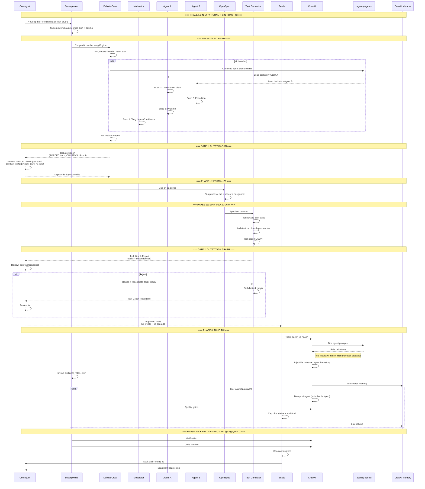

# Luồng dữ liệu v2: Human-as-Approver

Biểu đồ này thể hiện luồng dữ liệu trong mô hình mới, nơi con người chỉ duyệt thay vì tự tay làm.
So với v1: thêm Debate Crew, Approval Gates, và Task Graph Generator.



## So sánh Data Flow v1 vs v2

### v1: Con người ở giữa mỗi bước

```
U -> SP -> U -> OS -> U -> BD -> CR -> SP -> BD -> U
     hỏi    trả lời   tạo task       thực thi
```

### v2: Con người chỉ ở 2 approval gates

```
U -> SP -> DC(debate) -> [GATE 1] -> OS -> TG(gen tasks) -> [GATE 2] -> CR -> SP -> BD -> U
                          duyệt                               duyệt
```

## Điểm khác biệt chính

| Bước | v1 Data | v2 Data |
|---|---|---|
| Brainstorming | SP hỏi -> User trả lời (text) | SP sinh câu hỏi -> DC tranh luận -> Report (structured) |
| Quyết định | User suy nghĩ + trả lời | AI debate + status -> User approve/override |
| Tạo task | User chạy `bd create` (manual) | TG sinh JSON -> User approve (1-click) |
| Dependency | User chạy `bd dep add` (manual) | TG tự phân tích -> User approve (1-click) |
| Execution | Giữ nguyên | Giữ nguyên |
