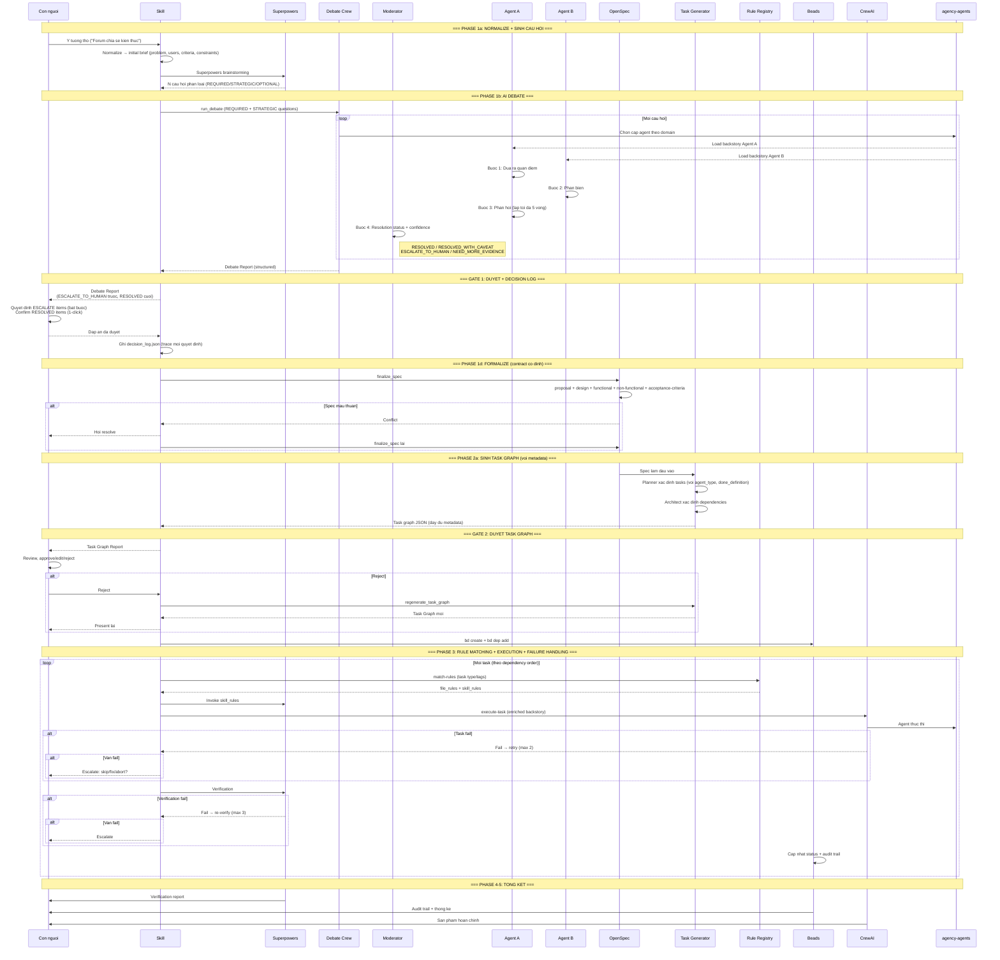

# Luồng dữ liệu v2: Human-as-Approver

Biểu đồ này thể hiện luồng dữ liệu trong mô hình mới, nơi con người chỉ duyệt thay vì tự tay làm.
So với v1: thêm Idea Normalization, Question Classification, Debate Crew, Decision Log, Approval Gates, Task Graph Generator, và Failure Handling.



## So sánh Data Flow v1 vs v2

### v1: Con người ở giữa mỗi bước

```
U -> SP -> U -> OS -> U -> BD -> CR -> SP -> BD -> U
     hỏi    trả lời   tạo task       thực thi
```

### v2: Con người chỉ ở 2 approval gates

```
U -> Normalize -> SP(questions) -> DC(debate) -> [GATE 1+log] -> OS -> TG -> [GATE 2] -> CR(+rules+retry) -> U
```

## Điểm khác biệt chính

| Bước | v1 Data | v2 Data |
|---|---|---|
| Input | Ý tưởng thô | Ý tưởng thô → normalized brief |
| Brainstorming | SP hỏi → User trả lời | SP sinh câu hỏi phân loại → DC tranh luận → Report |
| Quyết định | User suy nghĩ + trả lời | Resolution status → User approve/override + decision log |
| Spec | Free-form | 5 artifact cố định (contract) |
| Tạo task | User chạy `bd create` (manual) | TG sinh JSON với metadata → User approve |
| Dependency | User chạy `bd dep add` (manual) | TG tự phân tích → User approve |
| Execution | Không retry | Retry policy + escalate |
| Execution | Agent không biết rules | Rule Registry inject đúng rules theo task type |
