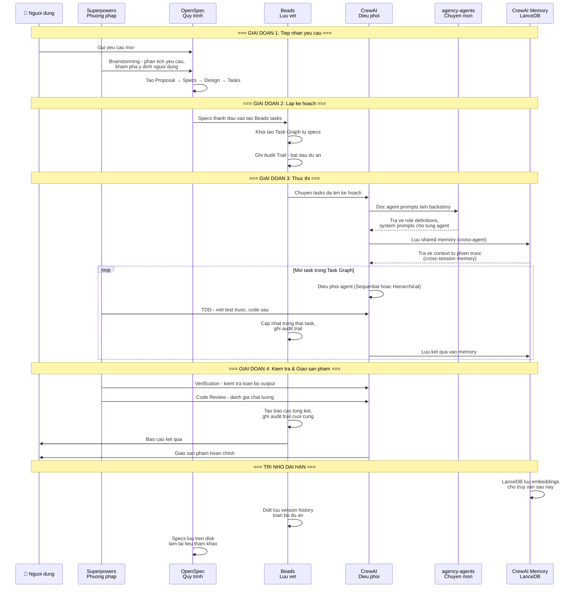

# Luong du lieu chi tiet

Bieu do nay mo ta luong du lieu thuc te giua cac thanh phan trong he thong. Khac voi bieu do tong quan, o day the hien ro Superpowers tham gia o MOI giai doan, Beads theo doi XUYEN SUOT, va CrewAI doc agent prompts tu agency-agents lam backstory cho tung agent.

