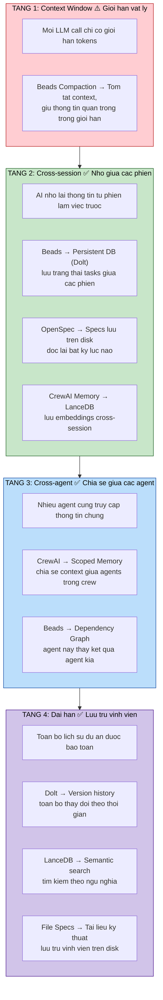

# 4 tang tri nho AI

He thong AI Development System giai quyet van de tri nho cua AI qua 4 tang, tu context window ngan han den luu tru dai han. Moi tang duoc ho tro boi mot hoac nhieu repo cu the, dam bao AI khong "quen" thong tin quan trong giua cac phien lam viec.

## Repo nao giai quyet tang nao

| Tang | Repo chinh | Co che |
|------|-----------|--------|
| Context Window | **Beads** | Compaction, tom tat tu dong |
| Cross-session | **Beads** + **OpenSpec** + **CrewAI Memory** | Persistent DB, file specs, LanceDB |
| Cross-agent | **CrewAI** + **Beads** | Scoped memory, dependency graph |
| Dai han | **Dolt** + **LanceDB** + **File Specs** | Version history, semantic search, disk storage |
