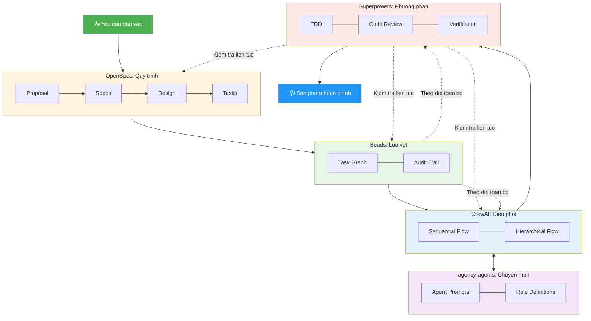

# Tong quan he thong

Bieu do nay the hien kien truc tong the cua AI Development System, tu luc nhan yeu cau dau vao cho den khi giao san pham hoan chinh. Moi thanh phan (repo) dam nhan mot vai tro cu the trong quy trinh phat trien phan mem tu dong hoa bang AI.

