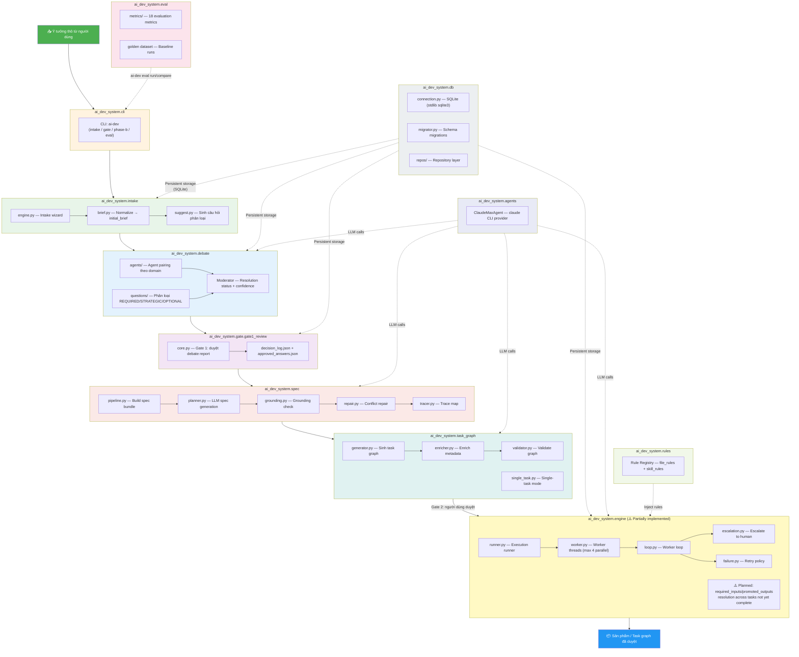

# Tổng quan hệ thống

Hệ thống AI Development System là một Python monorepo duy nhất (`src/ai_dev_system/`).
Không có external repo nào — toàn bộ logic nằm trong các module Python bên dưới.

## Các module chính

| Module | Package | Vai trò |
|--------|---------|---------|
| CLI | `ai_dev_system.cli` | Giao diện dòng lệnh `ai-dev` |
| Intake | `ai_dev_system.intake` | Intake wizard: normalize brief → câu hỏi phân loại |
| Debate | `ai_dev_system.debate` | Debate engine: agent tranh luận tối đa 5 vòng |
| Gate 1 | `ai_dev_system.gate.gate1_review` | Người dùng duyệt debate report + ghi decision log |
| Spec | `ai_dev_system.spec` | Build spec bundle (pipeline, grounding, repair) |
| Task Graph | `ai_dev_system.task_graph` | Sinh + validate task graph với metadata đầy đủ |
| Engine | `ai_dev_system.engine` | Execution runner + worker threads (⚠️ partial) |
| DB | `ai_dev_system.db` | SQLite persistence (stdlib `sqlite3`) |
| Eval | `ai_dev_system.eval` | Eval harness: golden dataset + 18 metrics |
| Agents | `ai_dev_system.agents` | LLM provider: ClaudeMaxAgent (`claude` CLI) |
| Rules | `ai_dev_system.rules` | Rule Registry: inject rules theo task type |

## Lưu trữ

Hệ thống dùng **SQLite** (stdlib `sqlite3`) làm persistent storage duy nhất.
Không có LanceDB, Dolt, hay PostgreSQL trong codebase hiện tại.
Schema được quản lý qua `ai_dev_system.db.migrator`.
