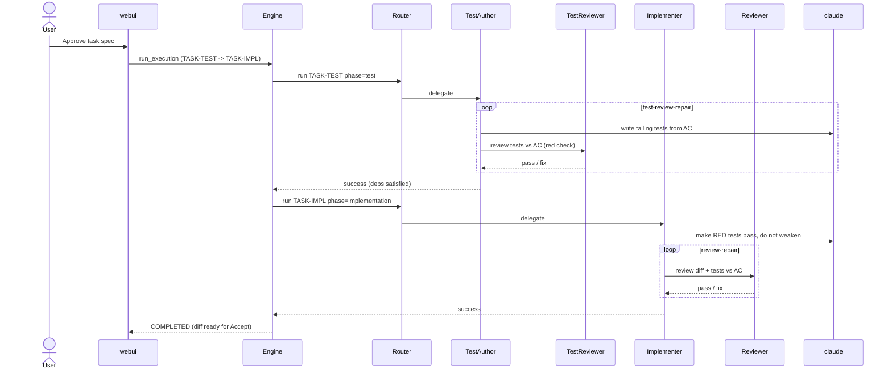

# TDD-first Test Split Implementation Plan

> **For agentic workers:** REQUIRED SUB-SKILL: Use superpowers:subagent-driven-development (recommended) or superpowers:executing-plans to implement this plan task-by-task. Steps use checkbox (`- [ ]`) syntax for tracking.

**Goal:** Split the single-task executor into a test-authoring phase (writes failing tests from the acceptance source, in its own `claude -p` context) followed by an implementation phase, with reviewers that compare tests directly against the acceptance source — breaking the circular "tests confirm the code that wrote them" problem.

**Architecture:** `single_task_executor` builds a 2-task graph (`TASK-TEST` → `TASK-IMPL`, ordered by `deps`) on the same git branch. A new `PhaseRoutingAgent` routes each task to `TestAuthorAgent` (phase=test) or `RepoBranchAgent` (phase=implementation). `TestAuthorAgent` runs a `TestReviewAgent` gate (tests↔AC) before implementation begins; `RepoBranchAgent`'s existing post-impl `ReviewAgent` gains a test-weakening check.

**Tech Stack:** Python 3.12+ stdlib only, `sqlite3`, `subprocess` (git + claude CLI), existing `engine/runner.py` + `engine/worker.py`, reuse of `_invoke_claude`/`_append_log` from `agents/repo_branch_agent.py`.

## Global Constraints

- Python 3.12+, zero new dependencies (stdlib + existing deps only).
- Reuse shared claude plumbing: `_invoke_claude(claude, cwd, prompt, max_turns, timeout_s, live_log_path) -> _ClaudeRun` and `_append_log(path, msg)` from `src/ai_dev_system/agents/repo_branch_agent.py`. Do NOT re-implement subprocess streaming.
- Claude CLI path: `ClaudeCodeLLMClient._resolve_claude_cmd()`.
- Agent protocol (from `agents/base.py`): `run(task_id, output_path, promoted_outputs=(), context=None, timeout_s=3600.0, file_rules=()) -> AgentResult`. `AgentResult(output_path, promoted_outputs=[], error=None)`; `.success == (error is None)`.
- Task context (`context_snapshot`) carries `phase`, `objective`, `description`, `done_definition`, `facets`. Facet shape: `{status: "filled"|"needs_human"|"na", content, reason}`; spec facet keys in `task_graph/facets.py::SPEC_FACET_KEYS`.
- Each task may declare at most ONE promoted output (`engine/worker.py` Phase-1 limit). Both new tasks use `required_inputs: []` (tests travel on the branch, not via artifacts).
- Env flags follow the existing pattern (`EXEC_REVIEW_GATE`, `EXEC_REVIEW_MAX_ROUNDS`): `EXEC_TDD_GATE` (default ON), `EXEC_TEST_REVIEW_MAX_ROUNDS` (default 2), `EXEC_TEST_REVIEW_MAX_TURNS` (turn budget for the test reviewer, default 40).
- Run the full suite before each commit: `python -m pytest tests/ -q`.
- Spec: `docs/superpowers/specs/2026-06-27-tdd-first-test-split-design.md`.

---

## File Structure

| File | Action | Responsibility |
|------|--------|----------------|
| `src/ai_dev_system/agents/test_review_agent.py` | CREATE | `TestReviewVerdict` + `TestReviewAgent`: independent context comparing committed tests ↔ acceptance source; test-phase blocking semantics (red = clean). |
| `src/ai_dev_system/agents/test_author_agent.py` | CREATE | `build_test_source(context)` helper + `TestAuthorAgent`: writes failing tests from the acceptance source, runs a test-review-repair loop. |
| `src/ai_dev_system/agents/phase_routing_agent.py` | CREATE | `PhaseRoutingAgent`: routes `run()` by `context["phase"]` to the test or impl agent. |
| `src/ai_dev_system/agents/repo_branch_agent.py` | MODIFY | Impl prompt: drop "write tests", add "tests exist / do not weaken". Pass test source into the post-impl reviewer. |
| `src/ai_dev_system/agents/review_agent.py` | MODIFY | `review()` takes optional `test_spec`; prompt adds the test-weakening-vs-AC check. |
| `src/ai_dev_system/task_graph/single_task_executor.py` | MODIFY | Build the 2-task graph behind `EXEC_TDD_GATE`; pass `PhaseRoutingAgent`. |
| `tests/unit/agents/test_test_review_agent.py` | CREATE | Verdict parsing + blocking semantics + prompt. |
| `tests/unit/agents/test_test_author_agent.py` | CREATE | `build_test_source`, prompt, repair loop. |
| `tests/unit/agents/test_phase_routing_agent.py` | CREATE | Routing by phase. |
| `tests/unit/agents/test_repo_branch_agent.py` | MODIFY | Impl prompt no longer says "write tests"; says "do not weaken". |
| `tests/unit/agents/test_review_agent.py` | MODIFY | Reviewer prompt includes weakening check when `test_spec` given. |
| `tests/unit/test_single_task_executor.py` | MODIFY | 2-task graph shape + gate flag. |
| `tests/integration/test_tdd_first_executor.py` | CREATE | 2-task run on a temp git repo with claude mocked. |
| `docs/architecture.md` | MODIFY | Update engine/agents sections for the TDD-first split. |
| `docs/workflow-v2.md` | MODIFY | Add the TDD-first single-task sequence. |

---

## Task 1: TestReviewAgent

**Files:**
- Create: `src/ai_dev_system/agents/test_review_agent.py`
- Test: `tests/unit/agents/test_test_review_agent.py`

**Interfaces:**
- Consumes: `_invoke_claude`, `_append_log` from `agents/repo_branch_agent.py`; `ClaudeCodeLLMClient._resolve_claude_cmd()`.
- Produces: `TestReviewVerdict(verdict: str, tests_red: bool, findings: list[dict], raw: str)` with `is_blocking() -> bool`; `TestReviewAgent(repo_path, base_branch, live_log_path=None).review(test_spec: str, objective: str = "", timeout_s: float = 1800.0) -> TestReviewVerdict`; module helpers `_parse_test_verdict(raw) -> TestReviewVerdict`, `_build_test_review_prompt(base_branch, objective, test_spec) -> str`.

- [ ] **Step 1: Write the failing test for blocking semantics + parsing**

```python
# tests/unit/agents/test_test_review_agent.py
from ai_dev_system.agents.test_review_agent import (
    TestReviewVerdict, _parse_test_verdict, _build_test_review_prompt,
)


def test_red_tests_no_findings_is_not_blocking():
    v = TestReviewVerdict(verdict="pass", tests_red=True, findings=[])
    assert v.is_blocking() is False


def test_green_tests_at_red_stage_is_blocking():
    # Tests passing without implementation => tautological / wrong => blocking.
    v = TestReviewVerdict(verdict="pass", tests_red=False, findings=[])
    assert v.is_blocking() is True


def test_high_severity_finding_is_blocking():
    v = TestReviewVerdict(verdict="pass", tests_red=True,
                          findings=[{"severity": "high", "issue": "AC-2 has no test"}])
    assert v.is_blocking() is True


def test_inconclusive_never_blocks():
    v = TestReviewVerdict(verdict="inconclusive", tests_red=False, findings=[])
    assert v.is_blocking() is False


def test_parse_extracts_json_from_prose():
    raw = 'here is my review\n{"verdict":"fail","tests_red":true,' \
          '"findings":[{"severity":"high","file":"t.py","line":3,"issue":"x"}]}\nthanks'
    v = _parse_test_verdict(raw)
    assert v.verdict == "fail"
    assert v.tests_red is True
    assert v.findings[0]["severity"] == "high"


def test_prompt_includes_test_spec_and_redness_instruction():
    p = _build_test_review_prompt("main", "Add login", "AC-1: returns 401 on bad creds")
    assert "AC-1: returns 401" in p
    assert "RED" in p or "fail" in p.lower()
```

- [ ] **Step 2: Run to verify it fails**

Run: `python -m pytest tests/unit/agents/test_test_review_agent.py -q`
Expected: FAIL — `ModuleNotFoundError: ai_dev_system.agents.test_review_agent`.

- [ ] **Step 3: Implement `test_review_agent.py`**

```python
# src/ai_dev_system/agents/test_review_agent.py
"""Reviewer for the test-authoring phase.

An independent `claude -p` pass that runs the repo test suite, confirms the
newly-authored tests are RED (failing because implementation is absent), and
compares them against the acceptance source (test_cases facet / AC). Returns a
structured verdict with TEST-PHASE blocking semantics: red is the expected,
clean state; green-at-this-stage or missing/weak coverage is blocking.
"""
from __future__ import annotations

import json
import os
from dataclasses import dataclass, field
from pathlib import Path
from typing import Optional

from ai_dev_system.llm_factory import ClaudeCodeLLMClient
from ai_dev_system.agents.repo_branch_agent import _invoke_claude, _append_log

_DEFAULT_TEST_REVIEW_MAX_TURNS = 40


def _test_review_max_turns() -> int:
    raw = os.environ.get("TEST_REVIEW_MAX_TURNS")
    if not raw:
        return _DEFAULT_TEST_REVIEW_MAX_TURNS
    try:
        n = int(raw)
    except (TypeError, ValueError):
        return _DEFAULT_TEST_REVIEW_MAX_TURNS
    return n if n > 0 else _DEFAULT_TEST_REVIEW_MAX_TURNS


@dataclass
class TestReviewVerdict:
    """Result of one test-phase review pass."""
    verdict: str = "inconclusive"        # "pass" | "fail" | "inconclusive"
    tests_red: bool = False              # do the NEW tests currently fail (expected)?
    findings: list[dict] = field(default_factory=list)  # [{severity,file,line,issue}]
    raw: str = ""

    _BLOCKING_SEVERITIES = ("high", "critical", "blocker")

    def is_blocking(self) -> bool:
        """Test-phase semantics — red is GOOD.

        Inconclusive (reviewer crashed / malformed JSON) never blocks: we do not
        wedge a task on review plumbing. Otherwise block when the tests are NOT
        red (tautological / already-passing => wrong), OR there is a high-severity
        finding (missing AC coverage, weak test), OR the reviewer said 'fail'.
        """
        if self.verdict == "inconclusive":
            return False
        if not self.tests_red:
            return True
        if any((f.get("severity") or "").lower() in self._BLOCKING_SEVERITIES
               for f in self.findings):
            return True
        return self.verdict == "fail"


def _build_test_review_prompt(base_branch: str, objective: str, test_spec: str) -> str:
    return (
        "You are an independent REVIEWER of TESTS just committed to THIS git branch "
        "BEFORE any implementation exists. Do NOT write code — only review.\n\n"
        f"## What the change is supposed to do\n{objective or '(not provided)'}\n\n"
        "## Acceptance source the tests MUST encode\n"
        f"{test_spec or '(none provided)'}\n\n"
        "## Steps\n"
        f"1. Inspect the new tests: `git diff {base_branch}..HEAD`.\n"
        "2. Run the repo test suite (auto-detect pytest / npm test / go test / etc.). "
        "The new tests MUST currently FAIL (RED) — implementation does not exist yet. "
        "If they PASS, they are almost certainly tautological or assert nothing real.\n"
        "3. For EACH acceptance item above, check there is a test that genuinely "
        "exercises the observable behaviour (not implementation detail, not a "
        "trivially-true assertion). Missing coverage or a weak/tautological test is "
        "a HIGH-severity finding.\n\n"
        "## Output\n"
        "Your FINAL message must be ONLY a single JSON object, no prose, no fences:\n"
        '{"verdict": "pass"|"fail", "tests_red": true|false, '
        '"findings": [{"severity": "low|medium|high|critical", "file": "...", '
        '"line": 0, "issue": "..."}]}\n'
        'Use "pass" only when the new tests are RED AND every acceptance item has a '
        "genuine test."
    )


def _parse_test_verdict(raw_text: str) -> TestReviewVerdict:
    text = (raw_text or "").strip()
    if not text:
        return TestReviewVerdict(raw=raw_text or "")
    candidate = text
    if "{" in text and "}" in text:
        candidate = text[text.index("{"): text.rindex("}") + 1]
    try:
        obj = json.loads(candidate)
    except (json.JSONDecodeError, ValueError):
        return TestReviewVerdict(raw=raw_text or "")
    if not isinstance(obj, dict):
        return TestReviewVerdict(raw=raw_text or "")
    verdict = str(obj.get("verdict") or "inconclusive").lower()
    if verdict not in ("pass", "fail"):
        verdict = "inconclusive"
    findings = obj.get("findings")
    findings = [f for f in findings if isinstance(f, dict)] if isinstance(findings, list) else []
    return TestReviewVerdict(
        verdict=verdict,
        tests_red=bool(obj.get("tests_red")),
        findings=findings,
        raw=raw_text or "",
    )


class TestReviewAgent:
    """Runs an independent `claude -p` review of the test-authoring phase."""

    def __init__(self, repo_path: str, base_branch: str, live_log_path: Optional[Path] = None) -> None:
        self.repo_path = repo_path
        self.base_branch = base_branch
        self.live_log_path = live_log_path

    def review(self, test_spec: str, objective: str = "", timeout_s: float = 1800.0) -> TestReviewVerdict:
        """Run the reviewer; never raises — failures degrade to inconclusive."""
        try:
            claude = ClaudeCodeLLMClient._resolve_claude_cmd()
        except Exception:
            return TestReviewVerdict()  # inconclusive — no reviewer available
        if self.live_log_path:
            _append_log(self.live_log_path, "Test reviewer bắt đầu (red check + tests↔AC)…")
        run = _invoke_claude(
            claude, self.repo_path,
            _build_test_review_prompt(self.base_branch, objective, test_spec),
            _test_review_max_turns(), timeout_s, self.live_log_path,
        )
        if run.timed_out or run.returncode != 0:
            return TestReviewVerdict(raw=(run.result_event or {}).get("result") or "")
        return _parse_test_verdict((run.result_event or {}).get("result") or "")
```

- [ ] **Step 4: Run tests to verify they pass**

Run: `python -m pytest tests/unit/agents/test_test_review_agent.py -q`
Expected: 6 passed.

- [ ] **Step 5: Commit**

```bash
git add src/ai_dev_system/agents/test_review_agent.py tests/unit/agents/test_test_review_agent.py
git commit -m "feat(agents): TestReviewAgent — test-phase review, tests vs AC, red=clean"
```

---

## Task 2: TestAuthorAgent

**Files:**
- Create: `src/ai_dev_system/agents/test_author_agent.py`
- Test: `tests/unit/agents/test_test_author_agent.py`

**Interfaces:**
- Consumes: `_invoke_claude`, `_append_log`, `_max_turns`, `_ClaudeRun` from `agents/repo_branch_agent.py`; `TestReviewAgent` from Task 1; `ClaudeCodeLLMClient._resolve_claude_cmd()`; `SPEC_FACET_KEYS` from `task_graph/facets.py`; `AgentResult` from `agents/base.py`.
- Produces: `build_test_source(context: dict) -> str` (facet keys `test_cases`, `input`, `response`, `error_cases`, `validation_rules` + any `acceptance_criteria` in context, filled facets only); `TestAuthorAgent(repo_path, branch_name, base_branch, live_log_path=None)` implementing the Agent protocol; `_build_test_prompt(context) -> str`; `_build_test_fix_prompt(objective, findings, tests_red) -> str`.

- [ ] **Step 1: Write the failing test for `build_test_source` + prompt**

```python
# tests/unit/agents/test_test_author_agent.py
from ai_dev_system.agents.test_author_agent import (
    build_test_source, _build_test_prompt, _build_test_fix_prompt,
)


def _ctx(objective="Add login", facets=None, acceptance_criteria=None):
    c = {
        "task_id": "TASK-TEST",
        "objective": objective,
        "description": "Implement JWT login",
        "done_definition": "Failing tests committed",
        "facets": facets or {},
    }
    if acceptance_criteria is not None:
        c["acceptance_criteria"] = acceptance_criteria
    return c


def test_source_includes_filled_test_cases_facet():
    src = build_test_source(_ctx(facets={
        "test_cases": {"status": "filled", "content": "401 on bad creds", "reason": ""},
        "input": {"status": "na", "content": "", "reason": "x"},
    }))
    assert "401 on bad creds" in src
    assert "x" not in src  # na facet excluded


def test_source_includes_acceptance_criteria_when_present():
    src = build_test_source(_ctx(acceptance_criteria="AC-1: returns JWT"))
    assert "AC-1: returns JWT" in src


def test_source_empty_when_nothing_filled():
    src = build_test_source(_ctx())
    assert src.strip() != ""  # returns a stable placeholder, never empty string


def test_prompt_says_tests_only_and_must_fail():
    p = _build_test_prompt(_ctx(facets={
        "test_cases": {"status": "filled", "content": "401 on bad creds", "reason": ""}}))
    assert "401 on bad creds" in p
    low = p.lower()
    assert "do not" in low and "implement" in low      # tests only, no implementation
    assert "fail" in low or "red" in low               # tests must be red


def test_fix_prompt_lists_findings():
    p = _build_test_fix_prompt("Add login",
                               [{"severity": "high", "file": "t.py", "line": 3, "issue": "AC-2 missing"}],
                               tests_red=True)
    assert "AC-2 missing" in p
```

- [ ] **Step 2: Run to verify it fails**

Run: `python -m pytest tests/unit/agents/test_test_author_agent.py -q`
Expected: FAIL — `ModuleNotFoundError: ai_dev_system.agents.test_author_agent`.

- [ ] **Step 3: Implement `test_author_agent.py`**

```python
# src/ai_dev_system/agents/test_author_agent.py
"""Agent for the test-authoring phase of the TDD-first split.

Runs `claude -p` to write FAILING tests from the acceptance source (test_cases
facet / acceptance criteria) — no implementation — then runs an independent
TestReviewAgent gate (red check + tests↔AC) and repairs ≤ N rounds before the
implementation phase begins.
"""
from __future__ import annotations

import json
import os
from pathlib import Path
from typing import Optional

from ai_dev_system.agents.base import AgentResult
from ai_dev_system.llm_factory import ClaudeCodeLLMClient
from ai_dev_system.task_graph.facets import SPEC_FACET_KEYS
from ai_dev_system.agents.repo_branch_agent import (
    _invoke_claude, _append_log, _max_turns, _git, _extract_summary,
)

# Facets that describe WHAT to test (the acceptance source for this task).
_TEST_SOURCE_FACETS = ("test_cases", "input", "response", "error_cases", "validation_rules")


def _test_review_max_rounds() -> int:
    raw = os.environ.get("EXEC_TEST_REVIEW_MAX_ROUNDS")
    if not raw:
        return 2
    try:
        n = int(raw)
    except (TypeError, ValueError):
        return 2
    return n if n >= 0 else 2


def build_test_source(context: dict) -> str:
    """Assemble the acceptance source the tests must encode, from filled facets
    (+ acceptance_criteria if present). Never returns an empty string."""
    facets = context.get("facets") or {}
    blocks: list[str] = []
    ac = (context.get("acceptance_criteria") or "").strip()
    if ac:
        blocks.append(f"### acceptance_criteria\n{ac}")
    for key in _TEST_SOURCE_FACETS:
        f = facets.get(key) or {}
        if f.get("status") == "filled" and f.get("content", "").strip():
            blocks.append(f"### {key}\n{f['content']}")
    if not blocks:
        return ("(no explicit test spec — derive observable behaviours from the "
                "objective and done-definition below)")
    return "\n\n".join(blocks)


def _build_test_prompt(context: dict) -> str:
    return (
        "You are writing TESTS for a coding task in THIS repository, BEFORE any "
        "implementation exists (test-driven development). Read existing test files "
        "to match the project's test framework and conventions first.\n\n"
        "## Task\n"
        f"**Objective:** {context.get('objective', '')}\n"
        f"**Description:** {context.get('description', '')}\n"
        f"**Done when:** {context.get('done_definition', '')}\n\n"
        "## Acceptance source — your tests MUST encode these\n"
        f"{build_test_source(context)}\n\n"
        "## Rules\n"
        "- Write ONLY tests. Do NOT implement the feature.\n"
        "- Each acceptance item must have a test asserting the OBSERVABLE behaviour "
        "(not implementation detail).\n"
        "- Run the tests. They MUST FAIL (RED) because the implementation is absent. "
        "Confirm they fail for the right reason (assertion / missing symbol), not a "
        "syntax error.\n"
        "- Commit with: `git add -A && git commit -m 'test: <summary>'`\n"
        "- Do NOT push to remote.\n"
    )


def _build_test_fix_prompt(objective: str, findings: list[dict], tests_red: bool) -> str:
    lines = []
    for f in findings:
        loc = f.get("file") or ""
        if f.get("line"):
            loc = f"{loc}:{f['line']}"
        sev = (f.get("severity") or "").upper()
        lines.append(f"- [{sev}] {loc} — {f.get('issue', '')}".strip())
    findings_block = "\n".join(lines) if lines else "(strengthen coverage of the acceptance source)"
    red_note = (
        "Some tests PASS without any implementation — they are tautological. Rewrite "
        "them to assert real behaviour so they FAIL until the feature is built.\n"
        if not tests_red else ""
    )
    return (
        "A review of the tests you just committed found problems. Fix every issue "
        "below, then commit the fixes. Still write TESTS ONLY — no implementation.\n\n"
        f"## Original objective\n{objective}\n\n"
        f"## Findings to fix\n{findings_block}\n\n"
        f"## Rules\n{red_note}"
        "- The tests must still be RED (failing) after your fixes.\n"
        "- Commit with: `git add -A && git commit -m 'test: address review findings'`\n"
        "- Do NOT push to remote.\n"
    )


class TestAuthorAgent:
    """Implements the Agent protocol. Writes failing tests, then review-repairs them."""

    def __init__(
        self,
        repo_path: str,
        branch_name: str,
        base_branch: str,
        live_log_path: Optional[Path] = None,
    ) -> None:
        self.repo_path = repo_path
        self.branch_name = branch_name
        self.base_branch = base_branch
        self.live_log_path = live_log_path

    def run(
        self,
        task_id: str,
        output_path: str,
        promoted_outputs=(),
        context: Optional[dict] = None,
        timeout_s: float = 1800.0,
        file_rules: list = (),
    ) -> AgentResult:
        Path(output_path).mkdir(parents=True, exist_ok=True)
        context = context or {}

        try:
            claude = ClaudeCodeLLMClient._resolve_claude_cmd()
        except Exception as exc:
            return AgentResult(output_path=output_path, error=f"claude CLI not found: {exc}")

        if self.live_log_path:
            _append_log(self.live_log_path, f"Test author bắt đầu task {task_id}…")

        run1 = _invoke_claude(
            claude, self.repo_path, _build_test_prompt(context),
            _max_turns(), timeout_s, self.live_log_path,
        )
        if run1.timed_out:
            self._write_outputs(output_path, run1, review=None)
            return AgentResult(output_path=output_path, error=f"claude timed out after {timeout_s}s")
        if run1.returncode != 0:
            self._write_outputs(output_path, run1, review=None)
            if run1.subtype == "error_max_turns":
                err = (f"test author reached the turn limit without finishing "
                       f"(no commit produced). Raise EXEC_MAX_TURNS or split the task.")
            else:
                err = f"claude CLI exited {run1.returncode}. stderr: {run1.stderr[:300]}"
            return AgentResult(output_path=output_path, error=err)

        review = self._review_and_repair(claude, context, timeout_s)
        self._write_outputs(output_path, run1, review)

        # A still-blocking test review (after the repair budget) FAILS the task so
        # the implementation phase never builds on untrustworthy tests.
        if review and review.get("review_status") == "flagged":
            return AgentResult(
                output_path=output_path,
                error=f"test review still flagged after repair: verdict={review.get('verdict')}",
            )
        return AgentResult(output_path=output_path)

    def _review_and_repair(self, claude: str, context: dict, timeout_s: float) -> dict:
        from ai_dev_system.agents.test_review_agent import TestReviewAgent

        max_rounds = _test_review_max_rounds()
        reviewer = TestReviewAgent(self.repo_path, self.base_branch, live_log_path=self.live_log_path)
        objective = str(context.get("objective", ""))
        test_spec = build_test_source(context)
        verdict = None
        rounds_fixed = 0

        for attempt in range(max_rounds + 1):
            verdict = reviewer.review(test_spec=test_spec, objective=objective, timeout_s=timeout_s)
            if self.live_log_path:
                _append_log(
                    self.live_log_path,
                    f"[test-review] verdict={verdict.verdict} tests_red={verdict.tests_red} "
                    f"findings={len(verdict.findings)}",
                )
            if not verdict.is_blocking():
                break
            if attempt >= max_rounds:
                break
            fix_run = _invoke_claude(
                claude, self.repo_path,
                _build_test_fix_prompt(objective, verdict.findings, verdict.tests_red),
                _max_turns(), timeout_s, self.live_log_path,
            )
            rounds_fixed += 1
            if fix_run.timed_out or fix_run.returncode != 0:
                break

        clean = verdict is not None and not verdict.is_blocking()
        return {
            "review_status": "clean" if clean else "flagged",
            "verdict": verdict.verdict if verdict else "inconclusive",
            "tests_red": verdict.tests_red if verdict else False,
            "findings": verdict.findings if verdict else [],
            "rounds_fixed": rounds_fixed,
        }

    def _write_outputs(self, output_path: str, claude_run, review: Optional[dict]) -> None:
        diff_text = _git(["diff", f"{self.base_branch}..HEAD"], self.repo_path).stdout or "(no diff)"
        summary = _extract_summary(claude_run.result_event, claude_run.returncode, len(claude_run.stdout))
        Path(output_path, "diff.txt").write_text(diff_text, encoding="utf-8")
        Path(output_path, "summary.txt").write_text(summary, encoding="utf-8")
        Path(output_path, "claude_stderr.txt").write_text(claude_run.stderr, encoding="utf-8")
        if review is not None:
            Path(output_path, "test_review.json").write_text(
                json.dumps(review, indent=2, ensure_ascii=False), encoding="utf-8"
            )
```

- [ ] **Step 4: Run tests to verify they pass**

Run: `python -m pytest tests/unit/agents/test_test_author_agent.py -q`
Expected: 5 passed.

- [ ] **Step 5: Commit**

```bash
git add src/ai_dev_system/agents/test_author_agent.py tests/unit/agents/test_test_author_agent.py
git commit -m "feat(agents): TestAuthorAgent — write failing tests from AC, review-repair gate"
```

---

## Task 3: Implementation prompt + reviewer weakening check

**Files:**
- Modify: `src/ai_dev_system/agents/repo_branch_agent.py` (`_build_execution_prompt`; pass test source into reviewer in `_review_and_repair`)
- Modify: `src/ai_dev_system/agents/review_agent.py` (`review()` signature + `_build_review_prompt`)
- Test: `tests/unit/agents/test_repo_branch_agent.py` (modify), `tests/unit/agents/test_review_agent.py` (modify)

**Interfaces:**
- Produces: `ReviewAgent.review(objective: str = "", test_spec: str = "", timeout_s: float = 1800.0) -> ReviewVerdict` (added `test_spec`); `_build_review_prompt(base_branch, objective, test_spec="") -> str`.
- Consumes: `build_test_source` from Task 2 inside `RepoBranchAgent._review_and_repair`.

- [ ] **Step 1: Update the failing tests for the impl prompt**

In `tests/unit/agents/test_repo_branch_agent.py`, replace any assertion that the impl prompt tells the agent to *write* tests. Add:

```python
def test_impl_prompt_does_not_ask_to_write_tests():
    from ai_dev_system.agents.repo_branch_agent import _build_execution_prompt
    p = _build_execution_prompt(_ctx())
    low = p.lower()
    assert "write tests" not in low
    assert "tests already exist" in low
    assert "weaken" in low  # must forbid weakening tests
```

(Keep the existing facet-inclusion tests unchanged — `_build_execution_prompt` still renders filled facets.)

- [ ] **Step 2: Add the failing test for the reviewer weakening check**

In `tests/unit/agents/test_review_agent.py`:

```python
def test_review_prompt_includes_weakening_check_when_test_spec_given():
    from ai_dev_system.agents.review_agent import _build_review_prompt
    p = _build_review_prompt("main", "Add login", test_spec="AC-1: returns 401")
    assert "AC-1: returns 401" in p
    assert "weaken" in p.lower()


def test_review_prompt_omits_weakening_block_without_test_spec():
    from ai_dev_system.agents.review_agent import _build_review_prompt
    p = _build_review_prompt("main", "Add login", test_spec="")
    assert "AC-1" not in p
```

- [ ] **Step 3: Run to verify they fail**

Run: `python -m pytest tests/unit/agents/test_repo_branch_agent.py tests/unit/agents/test_review_agent.py -q`
Expected: FAIL — new assertions (`tests already exist`, `weaken`, `test_spec` kwarg) not yet present.

- [ ] **Step 4: Edit `_build_execution_prompt` in `repo_branch_agent.py`**

Replace the prompt's instruction block. Change the return value of `_build_execution_prompt` so the intro and Rules read:

```python
    return (
        "You are implementing a coding task in THIS repository. "
        "Read existing code to understand patterns and conventions before writing anything. "
        "Tests already exist on this branch and are currently FAILING — implement the "
        "feature until they pass, then commit.\n\n"
        f"## Task\n"
        f"**Objective:** {context.get('objective', '')}\n"
        f"**Description:** {context.get('description', '')}\n"
        f"**Done when:** {context.get('done_definition', '')}\n\n"
        f"## Technical Specification\n{spec_section}\n\n"
        "## Rules\n"
        "- Follow existing code style and patterns in this repo\n"
        "- Tests already exist and are RED — make them pass; do NOT delete or weaken "
        "tests to make them pass\n"
        "- You MAY edit a test ONLY if it is genuinely wrong; if so, explain why in the "
        "commit message\n"
        "- Run the full test suite before committing\n"
        "- Commit with: `git add -A && git commit -m '<type>: <summary>'`\n"
        "- Do NOT push to remote\n"
    )
```

- [ ] **Step 5: Pass the test source into the reviewer in `_review_and_repair`**

In `repo_branch_agent.py`, at the top of `_review_and_repair`, add the import and compute the test spec, then pass it to `reviewer.review`:

```python
        from ai_dev_system.agents.review_agent import ReviewAgent
        from ai_dev_system.agents.test_author_agent import build_test_source

        max_rounds = _review_max_rounds()
        reviewer = ReviewAgent(self.repo_path, self.base_branch, live_log_path=self.live_log_path)
        objective = str(context.get("objective", ""))
        test_spec = build_test_source(context)
        verdict = None
        rounds_fixed = 0

        for attempt in range(max_rounds + 1):
            verdict = reviewer.review(objective=objective, test_spec=test_spec, timeout_s=timeout_s)
```

(Leave the rest of the loop unchanged.)

- [ ] **Step 6: Update `ReviewAgent.review` + `_build_review_prompt` in `review_agent.py`**

Change the signature and prompt:

```python
def _build_review_prompt(base_branch: str, objective: str, test_spec: str = "") -> str:
    weakening_block = ""
    if test_spec:
        weakening_block = (
            "\n## Test integrity (tests were authored BEFORE the implementation)\n"
            "The tests on this branch encode this acceptance source:\n"
            f"{test_spec}\n"
            f"Inspect whether the implementer changed any test: `git log {base_branch}..HEAD` "
            f"and `git diff {base_branch}..HEAD -- '*test*'`. Any test that was deleted, "
            "skipped, or weakened so it no longer enforces the acceptance source above is a "
            "HIGH-severity finding.\n"
        )
    return (
        "You are an independent REVIEWER of a code change just committed to THIS "
        "git branch. Do NOT make changes — only review.\n\n"
        f"## What the change was supposed to do\n{objective or '(not provided)'}\n\n"
        "## Steps\n"
        "1. Find and run this repo's test suite (auto-detect: pytest, npm test, "
        "go test, cargo test, etc.). Note whether tests ran and whether they passed.\n"
        f"2. Review the diff: `git diff {base_branch}..HEAD`. Look hardest for "
        "INTEGRATION bugs, not just style: is new code actually reached from a "
        "non-test path (grep for callers)? Do referenced functions, fields, DB "
        "columns, and config keys actually exist where the code runs? Does it match "
        "the real runtime data shapes, not just what the tests fabricate? Also check "
        "correctness: wrong/inverted conditions, missing error handling, off-by-one.\n"
        "3. Only report findings you have VERIFIED are real (prefer fewer, certain "
        "findings over noise). Severity is one of: low, medium, high, critical.\n"
        f"{weakening_block}"
        "\n## Output\n"
        "Your FINAL message must be ONLY a single JSON object, no prose, no code "
        "fences, exactly this shape:\n"
        '{"verdict": "pass" | "fail", "tests_ran": true|false, '
        '"tests_passed": true|false, '
        '"findings": [{"severity": "...", "file": "...", "line": 0, "issue": "..."}]}\n'
        "Use verdict \"pass\" only when tests pass (or there are genuinely no tests) "
        "AND there are no high/critical findings."
    )
```

And update `review()`:

```python
    def review(self, objective: str = "", test_spec: str = "", timeout_s: float = 1800.0) -> ReviewVerdict:
        try:
            claude = ClaudeCodeLLMClient._resolve_claude_cmd()
        except Exception:
            return ReviewVerdict()
        if self.live_log_path:
            _append_log(self.live_log_path, "Reviewer bắt đầu kiểm tra (test + diff)…")
        run = _invoke_claude(
            claude, self.repo_path, _build_review_prompt(self.base_branch, objective, test_spec),
            _review_max_turns(), timeout_s, self.live_log_path,
        )
        if run.timed_out or run.returncode != 0:
            return ReviewVerdict(raw=(run.result_event or {}).get("result") or "")
        result_text = (run.result_event or {}).get("result") or ""
        return _parse_verdict(result_text)
```

- [ ] **Step 7: Run the affected tests**

Run: `python -m pytest tests/unit/agents/test_repo_branch_agent.py tests/unit/agents/test_review_agent.py -q`
Expected: all pass (including the new assertions).

- [ ] **Step 8: Commit**

```bash
git add src/ai_dev_system/agents/repo_branch_agent.py src/ai_dev_system/agents/review_agent.py tests/unit/agents/test_repo_branch_agent.py tests/unit/agents/test_review_agent.py
git commit -m "feat(agents): impl prompt expects existing tests; reviewer checks test weakening vs AC"
```

---

## Task 4: PhaseRoutingAgent

**Files:**
- Create: `src/ai_dev_system/agents/phase_routing_agent.py`
- Test: `tests/unit/agents/test_phase_routing_agent.py`

**Interfaces:**
- Consumes: `TestAuthorAgent` (Task 2), `RepoBranchAgent` (existing); `AgentResult`.
- Produces: `PhaseRoutingAgent(repo_path, branch_name, base_branch, live_log_path=None)` implementing the Agent protocol; routes `run()` by `context["phase"]` — `"test"` → test agent, anything else → impl agent.

- [ ] **Step 1: Write the failing routing test**

```python
# tests/unit/agents/test_phase_routing_agent.py
from unittest.mock import MagicMock
from ai_dev_system.agents.base import AgentResult
from ai_dev_system.agents.phase_routing_agent import PhaseRoutingAgent


def _agent(repo="/repo"):
    a = PhaseRoutingAgent(repo, "ai-dev/task-x", "main")
    a.test_agent = MagicMock()
    a.impl_agent = MagicMock()
    a.test_agent.run.return_value = AgentResult(output_path="out")
    a.impl_agent.run.return_value = AgentResult(output_path="out")
    return a


def test_phase_test_routes_to_test_agent():
    a = _agent()
    a.run("TASK-TEST", "out", context={"phase": "test"})
    a.test_agent.run.assert_called_once()
    a.impl_agent.run.assert_not_called()


def test_phase_implementation_routes_to_impl_agent():
    a = _agent()
    a.run("TASK-IMPL", "out", context={"phase": "implementation"})
    a.impl_agent.run.assert_called_once()
    a.test_agent.run.assert_not_called()


def test_missing_phase_defaults_to_impl_agent():
    a = _agent()
    a.run("TASK", "out", context={})
    a.impl_agent.run.assert_called_once()
```

- [ ] **Step 2: Run to verify it fails**

Run: `python -m pytest tests/unit/agents/test_phase_routing_agent.py -q`
Expected: FAIL — `ModuleNotFoundError`.

- [ ] **Step 3: Implement `phase_routing_agent.py`**

```python
# src/ai_dev_system/agents/phase_routing_agent.py
"""Routes a task to the test-authoring or implementation agent by phase.

`run_execution` takes a single agent used for every task in the graph. This
adapter inspects the per-task context and delegates: phase=="test" goes to
TestAuthorAgent, everything else goes to RepoBranchAgent. Both sub-agents share
the same repo / branch / base / live-log.
"""
from __future__ import annotations

from pathlib import Path
from typing import Optional

from ai_dev_system.agents.base import AgentResult
from ai_dev_system.agents.repo_branch_agent import RepoBranchAgent
from ai_dev_system.agents.test_author_agent import TestAuthorAgent


class PhaseRoutingAgent:
    """Implements the Agent protocol; dispatches by context['phase']."""

    def __init__(
        self,
        repo_path: str,
        branch_name: str,
        base_branch: str,
        live_log_path: Optional[Path] = None,
    ) -> None:
        self.repo_path = repo_path
        self.branch_name = branch_name
        self.base_branch = base_branch
        self.live_log_path = live_log_path
        self.test_agent = TestAuthorAgent(repo_path, branch_name, base_branch, live_log_path)
        self.impl_agent = RepoBranchAgent(repo_path, branch_name, base_branch, live_log_path)

    def run(
        self,
        task_id: str,
        output_path: str,
        promoted_outputs=(),
        context: Optional[dict] = None,
        timeout_s: float = 1800.0,
        file_rules: list = (),
    ) -> AgentResult:
        phase = (context or {}).get("phase")
        target = self.test_agent if phase == "test" else self.impl_agent
        return target.run(
            task_id=task_id,
            output_path=output_path,
            promoted_outputs=promoted_outputs,
            context=context,
            timeout_s=timeout_s,
            file_rules=file_rules,
        )
```

- [ ] **Step 4: Run tests to verify they pass**

Run: `python -m pytest tests/unit/agents/test_phase_routing_agent.py -q`
Expected: 3 passed.

- [ ] **Step 5: Commit**

```bash
git add src/ai_dev_system/agents/phase_routing_agent.py tests/unit/agents/test_phase_routing_agent.py
git commit -m "feat(agents): PhaseRoutingAgent — dispatch test vs implementation by phase"
```

---

## Task 5: Executor builds the 2-task graph

**Files:**
- Modify: `src/ai_dev_system/task_graph/single_task_executor.py` (lines ~251-269 graph build; ~299-304 agent build; add `_tdd_gate_enabled` + `_build_task_graph`)
- Test: `tests/unit/test_single_task_executor.py` (add cases)

**Interfaces:**
- Produces: `_tdd_gate_enabled() -> bool` (reads `EXEC_TDD_GATE`, default True); `_build_task_graph(task: dict, facets: dict, branch_name: str, base_branch: str) -> dict`.
- Consumes: `PhaseRoutingAgent` (Task 4).

- [ ] **Step 1: Write the failing test for the graph shape**

```python
# tests/unit/test_single_task_executor.py  (add)
import os
from unittest.mock import patch


def _task():
    return {"id": "TASK-1", "type": "coding", "objective": "Add login",
            "description": "d", "done_definition": ""}


def test_tdd_gate_builds_two_tasks_with_dep():
    from ai_dev_system.task_graph.single_task_executor import _build_task_graph
    with patch.dict(os.environ, {"EXEC_TDD_GATE": "1"}):
        g = _build_task_graph(_task(), {"test_cases": {"status": "filled", "content": "x", "reason": ""}},
                              "ai-dev/task-abc", "main")
    ids = [t["id"] for t in g["tasks"]]
    assert ids == ["TASK-1-TEST", "TASK-1-IMPL"]
    test_t, impl_t = g["tasks"]
    assert test_t["phase"] == "test" and test_t["agent_type"] == "TestAuthorAgent"
    assert test_t["deps"] == []
    assert impl_t["phase"] == "implementation" and impl_t["agent_type"] == "RepoBranchAgent"
    assert impl_t["deps"] == ["TASK-1-TEST"]
    # each task at most one promoted output
    assert len(test_t["expected_outputs"]) == 1 and len(impl_t["expected_outputs"]) == 1


def test_gate_off_builds_single_task():
    from ai_dev_system.task_graph.single_task_executor import _build_task_graph
    with patch.dict(os.environ, {"EXEC_TDD_GATE": "0"}):
        g = _build_task_graph(_task(), {}, "ai-dev/task-abc", "main")
    assert len(g["tasks"]) == 1
    assert g["tasks"][0]["phase"] == "implementation"
```

- [ ] **Step 2: Run to verify it fails**

Run: `python -m pytest tests/unit/test_single_task_executor.py -q -k "tdd_gate or gate_off"`
Expected: FAIL — `_build_task_graph` does not exist.

- [ ] **Step 3: Add `_tdd_gate_enabled` + `_build_task_graph` to the executor**

Add near the top of `single_task_executor.py` (after imports):

```python
def _tdd_gate_enabled() -> bool:
    """TDD-first split is ON unless EXEC_TDD_GATE is explicitly falsy."""
    v = os.environ.get("EXEC_TDD_GATE")
    if v is None:
        return True
    return v.strip().lower() not in ("0", "false", "no", "off", "")


def _build_task_graph(task: dict, facets: dict, branch_name: str, base_branch: str) -> dict:
    """Single-task graph. With the TDD gate on, emit TASK-TEST → TASK-IMPL
    (same branch, ordered by deps). Off, emit the legacy single impl task."""
    base_id = task.get("id") or "TASK-ADHOC"
    objective = task.get("objective") or ""
    description = task.get("description") or ""
    impl_done = task.get("done_definition") or f"Code committed to branch {branch_name}"

    impl_task = {
        "id": f"{base_id}-IMPL" if _tdd_gate_enabled() else base_id,
        "execution_type": "atomic",
        "agent_type": "RepoBranchAgent",
        "phase": "implementation",
        "type": task.get("type") or "coding",
        "objective": objective,
        "description": description,
        "done_definition": impl_done,
        "verification_steps": [],
        "required_inputs": [],
        "expected_outputs": ["implementation_diff"],
        "deps": [],
        "facets": facets,
    }
    if not _tdd_gate_enabled():
        return {"tasks": [impl_task]}

    test_task = {
        "id": f"{base_id}-TEST",
        "execution_type": "atomic",
        "agent_type": "TestAuthorAgent",
        "phase": "test",
        "type": "test",
        "objective": objective,
        "description": description,
        "done_definition": "Failing tests committed from the acceptance source",
        "verification_steps": [],
        "required_inputs": [],
        "expected_outputs": ["test_files"],
        "deps": [],
        "facets": facets,
    }
    impl_task["deps"] = [test_task["id"]]
    return {"tasks": [test_task, impl_task]}
```

- [ ] **Step 4: Use `_build_task_graph` and `PhaseRoutingAgent` in `run_executor`**

Replace the inline `task_graph = {...}` block (lines ~252-269) with:

```python
    task_graph = _build_task_graph(task, facets, branch_name, base_branch)
```

Replace the `agent = RepoBranchAgent(...)` block (lines ~299-304) with:

```python
    from ai_dev_system.agents.phase_routing_agent import PhaseRoutingAgent
    agent = PhaseRoutingAgent(
        repo_path=repo_path,
        branch_name=branch_name,
        base_branch=base_branch,
        live_log_path=log_path,
    )
```

(Leave the existing `from ai_dev_system.agents.repo_branch_agent import RepoBranchAgent` import — it is still referenced by tests / fallback. If a linter flags it unused after this change, remove it.)

- [ ] **Step 5: Run the executor tests**

Run: `python -m pytest tests/unit/test_single_task_executor.py -q`
Expected: all pass (existing + 2 new).

- [ ] **Step 6: Commit**

```bash
git add src/ai_dev_system/task_graph/single_task_executor.py tests/unit/test_single_task_executor.py
git commit -m "feat(executor): build TASK-TEST→TASK-IMPL graph behind EXEC_TDD_GATE; route via PhaseRoutingAgent"
```

---

## Task 6: Integration test — 2-task run on a temp git repo

**Files:**
- Create: `tests/integration/test_tdd_first_executor.py`

**Interfaces:**
- Consumes: `run_execution` (engine), `PhaseRoutingAgent`, `_build_task_graph`, `_create_run_row`, `_create_task_graph_artifact` from the executor; `get_connection`; `Config.from_env`.
- Verifies: with `claude` mocked, TASK-TEST runs and SUCCEEDs before TASK-IMPL, and the run reaches COMPLETED.

- [ ] **Step 1: Write the integration test**

```python
# tests/integration/test_tdd_first_executor.py
"""TDD-first 2-task run end-to-end with claude mocked.

We stub `_invoke_claude` so both agents 'commit' on a real temp git branch and
the reviewers return clean verdicts, then assert ordering + terminal state.
"""
import os
import subprocess
import uuid
from pathlib import Path
from unittest.mock import patch

import pytest

from ai_dev_system.agents.repo_branch_agent import _ClaudeRun


def _git(args, cwd):
    return subprocess.run(["git", *args], cwd=cwd, capture_output=True, text=True, encoding="utf-8")


@pytest.fixture
def temp_repo(tmp_path):
    repo = tmp_path / "repo"
    repo.mkdir()
    _git(["init"], repo)
    _git(["config", "user.email", "t@t"], repo)
    _git(["config", "user.name", "t"], repo)
    (repo / "README.md").write_text("x", encoding="utf-8")
    _git(["add", "-A"], repo)
    _git(["commit", "-m", "init"], repo)
    _git(["checkout", "-b", "ai-dev/task-it"], repo)
    return repo


def _claude_commit(repo, fname, msg):
    """Return a fake _ClaudeRun that actually creates+commits a file on the branch."""
    (Path(repo) / fname).write_text("content", encoding="utf-8")
    _git(["add", "-A"], repo)
    _git(["commit", "-m", msg], repo)
    return _ClaudeRun(returncode=0, stdout='{"type":"result","result":"done"}', stderr="",
                      result_event={"type": "result", "result": "done"}, subtype="success")


def test_two_task_run_orders_test_before_impl(temp_repo, monkeypatch):
    from ai_dev_system.config import Config
    from ai_dev_system.db.connection import get_connection
    from ai_dev_system.engine.runner import run_execution
    from ai_dev_system.agents.phase_routing_agent import PhaseRoutingAgent
    from ai_dev_system.task_graph import single_task_executor as ste
    from ai_dev_system.agents import test_review_agent as tra
    from ai_dev_system.agents import review_agent as ra

    monkeypatch.setenv("EXEC_TDD_GATE", "1")
    cfg = Config.from_env()

    calls = []

    def fake_invoke(claude, cwd, prompt, max_turns, timeout_s, live_log_path=None):
        low = prompt.lower()
        if "write tests" in low or "writing tests" in low:
            calls.append("test")
            return _claude_commit(cwd, "tests/test_new.py", "test: add failing tests")
        if "reviewer of tests" in low:  # TestReviewAgent prompt
            return _ClaudeRun(0, '{"verdict":"pass","tests_red":true,"findings":[]}', "",
                              {"type": "result", "result": '{"verdict":"pass","tests_red":true,"findings":[]}'}, "success")
        if "independent reviewer of a code change" in low:  # ReviewAgent
            return _ClaudeRun(0, '{"verdict":"pass","tests_ran":true,"tests_passed":true,"findings":[]}', "",
                              {"type": "result", "result": '{"verdict":"pass","tests_ran":true,"tests_passed":true,"findings":[]}'}, "success")
        calls.append("impl")
        return _claude_commit(cwd, "src/feature.py", "feat: implement")

    with patch("ai_dev_system.agents.repo_branch_agent._invoke_claude", side_effect=fake_invoke), \
         patch("ai_dev_system.agents.test_author_agent._invoke_claude", side_effect=fake_invoke), \
         patch("ai_dev_system.agents.test_review_agent._invoke_claude", side_effect=fake_invoke), \
         patch("ai_dev_system.agents.review_agent._invoke_claude", side_effect=fake_invoke), \
         patch("ai_dev_system.llm_factory.ClaudeCodeLLMClient._resolve_claude_cmd", return_value="claude"):
        run_id = uuid.uuid4().hex
        conn = get_connection(cfg.database_url)
        ste._create_run_row(conn, run_id, "it", "spec-it", "ai-dev/task-it")
        graph = ste._build_task_graph({"id": "TASK-1", "type": "coding", "objective": "o",
                                       "description": "d", "done_definition": ""},
                                      {"test_cases": {"status": "filled", "content": "401", "reason": ""}},
                                      "ai-dev/task-it", "master")
        gid = ste._create_task_graph_artifact(conn, run_id, graph, cfg.storage_root)
        conn.close()
        agent = PhaseRoutingAgent(str(temp_repo), "ai-dev/task-it", "master")
        result = run_execution(run_id, gid, cfg, agent, poll_interval_s=0.2)

    assert result.status == "COMPLETED"
    assert calls.index("test") < calls.index("impl")  # test phase ran first
    log = _git(["log", "--oneline"], temp_repo).stdout
    assert "test: add failing tests" in log
    assert "feat: implement" in log
```

- [ ] **Step 2: Run the integration test**

Run: `python -m pytest tests/integration/test_tdd_first_executor.py -q`
Expected: PASS. If `Config.from_env()` needs env (storage_root / database_url), set them in the test via `monkeypatch.setenv` to a `tmp_path`-based SQLite file (mirror an existing integration test's fixture in `tests/integration/`).

- [ ] **Step 3: Commit**

```bash
git add tests/integration/test_tdd_first_executor.py
git commit -m "test(integration): TDD-first 2-task run orders test before impl, reaches COMPLETED"
```

---

## Task 7: Update official documentation

**Files:**
- Modify: `docs/architecture.md` (sections 5/6/9 + known-limitations)
- Modify: `docs/workflow-v2.md` (add TDD-first single-task sequence)

**Interfaces:** none (docs only). No checkbox test cycle — this task's deliverable is the docs themselves.

- [ ] **Step 1: Update `docs/architecture.md` engine + agents sections**

In section `### 9. ai_dev_system.agents — LLM providers`, append:

```markdown
- **TDD-first single-task split** (`EXEC_TDD_GATE`, default on): the executor emits
  two tasks — `TASK-TEST` (`TestAuthorAgent`) then `TASK-IMPL` (`RepoBranchAgent`),
  routed by `PhaseRoutingAgent`. `TestAuthorAgent` writes FAILING tests from the
  acceptance source (the `test_cases` facet / acceptance criteria) in its own
  context, gated by `TestReviewAgent` (red check + tests↔AC) before implementation.
  The post-impl `ReviewAgent` additionally flags any test the implementer weakened
  relative to the acceptance source. See
  [specs/2026-06-27-tdd-first-test-split-design.md](superpowers/specs/2026-06-27-tdd-first-test-split-design.md).
```

In `### 6. ai_dev_system.engine`, change the single-task note line to:

```markdown
**⚠️ Lưu ý:** single-task execution đã hoạt động (TDD-first: test phase → impl phase). Multi-task graph execution với required_inputs/promoted_outputs resolution chưa hoàn chỉnh.
```

- [ ] **Step 2: Add the TDD-first sequence to `docs/workflow-v2.md`**

Append a new section at the end of `docs/workflow-v2.md`:

```markdown
## TDD-first single-task execution

After a task spec is approved in the webui, the executor runs two ordered phases
on one git branch instead of one combined phase — so tests are authored from the
acceptance source before any implementation exists.


```

- [ ] **Step 3: Sanity-check the docs render**

Run: `python -m pytest tests/ -q` (confirm no doc-driven test broke), and eyeball the two `mermaid` fences for balanced ``` fences.
Expected: suite green; fences balanced.

- [ ] **Step 4: Commit**

```bash
git add docs/architecture.md docs/workflow-v2.md
git commit -m "docs: document TDD-first single-task split (architecture + workflow-v2)"
```

---

## Final verification

- [ ] **Run the full suite**

Run: `python -m pytest tests/ -q`
Expected: all green (memory baseline was 1513 passed; this adds new tests, none removed).

- [ ] **Confirm the rollback switch**

Run: `EXEC_TDD_GATE=0 python -m pytest tests/unit/test_single_task_executor.py -q`
Expected: single-task graph path still passes — legacy behaviour intact.

---

## Self-Review

**Spec coverage:**
- TDD-first ordering (decision 1) → Tasks 5 (graph deps) + 6 (integration ordering assertion).
- Single-task path, reusable agents (decision 2) → Tasks 1-4 are graph-agnostic; Task 5 wires single-task; full-pipeline reuse noted, not implemented (matches spec "NOT in scope").
- Controlled test edits (decision 3) → Task 3 impl prompt ("may edit only if wrong, do not weaken") + reviewer weakening check.
- Source of truth = `test_cases` facet / AC → Task 2 `build_test_source`.
- `PhaseRoutingAgent` reuse seam → Task 4.
- `EXEC_TDD_GATE` / `EXEC_TEST_REVIEW_MAX_ROUNDS` → Tasks 5 / 2.
- Test-phase verdict semantics (red = clean) → Task 1 `TestReviewVerdict.is_blocking`.
- Failure mode "TASK-TEST fails → IMPL never runs" → relies on engine `deps` + `propagate_failure`; TestAuthorAgent returns an error when the review stays flagged (Task 2 Step 3) so the dep gate engages.
- Official docs update (explicit user ask) → Task 7.

**Placeholder scan:** No TBD/TODO; every code step shows full code; every test step shows assertions.

**Type consistency:** `build_test_source(context)` defined in Task 2, consumed in Task 3 (`repo_branch_agent`) — same signature. `ReviewAgent.review(objective, test_spec, timeout_s)` defined and called consistently (Task 3). `_build_task_graph(task, facets, branch_name, base_branch)` defined in Task 5, called in `run_executor` and Task 6 with the same argument order. `TestReviewVerdict`/`TestReviewAgent.review(test_spec, objective, timeout_s)` consistent between Tasks 1 and 2. `PhaseRoutingAgent` attributes `test_agent`/`impl_agent` match the routing test in Task 4.
