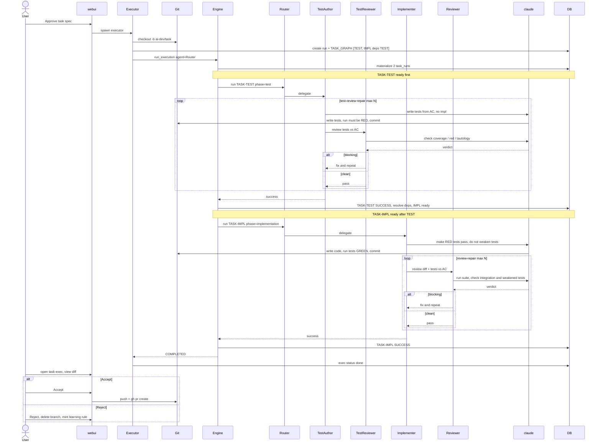

# TDD-first Test Split — Design

> **Status:** design approved 2026-06-27. Next: implementation plan.
> **Scope (this spec):** single-task executor path only, designed so the new agents
> are reused verbatim by the full spec-bundle pipeline later.

## Problem

Today the implementer agent writes code **and** tests in the **same `claude -p` context**
([`repo_branch_agent.py:103`](../../../src/ai_dev_system/agents/repo_branch_agent.py) —
`"...Implement the task completely, write tests, and commit..."`). Tests authored by the
same context that wrote the implementation tend to confirm *that implementation* rather than
the *requirement* — a circular, self-confirming test. A logic bug in the code is mirrored by
a matching bug in the test, so the suite stays green and the error survives.

The existing defenses are all **downstream** and **detect-after**:

- Acceptance criteria are spec-derived ([`acceptance_criteria.py`](../../../src/ai_dev_system/spec/generators/acceptance_criteria.py)) but only exist in the full spec-bundle pipeline, not the single-task path.
- The Gate-3 verification pipeline ([`verification/pipeline.py`](../../../src/ai_dev_system/verification/pipeline.py)) judges against `acceptance-criteria.md`, independent of the implementer's tests — full pipeline only.
- The post-impl review gate ([`review_agent.py`](../../../src/ai_dev_system/agents/review_agent.py)) is an independent context already prompted to distrust *"what the tests fabricate"*.

None of these **prevent** the circular test at authoring time. There is no test-first barrier.

## Principle

Author the tests **first**, from an **independent source** (the `test_cases` facet / acceptance
criteria), in a **separate context**, and **commit them while RED** — before any implementation
exists. Implementation then makes them green. A reviewer compares the tests directly against the
acceptance source. Because the tests are committed before the implementation exists, they cannot
be shaped by it.

## Key decisions (locked)

| # | Decision | Choice |
|---|----------|--------|
| 1 | Ordering of test vs implementation phase | **Test-first (real TDD)** — test phase runs before implementation |
| 2 | Rollout scope | **Single-task path first**, agents designed for reuse by the full pipeline |
| 3 | May the implementer edit test files? | **Controlled edits** — allowed but must justify; reviewer compares edited tests ↔ AC, any weakening = blocking |

## Source of truth for tests

- **Single-task path (this spec):** the `test_cases` facet
  ([`facets.py:16-21`](../../../src/ai_dev_system/task_graph/facets.py) — *"Concrete test scenarios
  (unit/integration) for this task"*), supported by `input`, `response`, `error_cases`,
  `validation_rules`. These are filled by the LLM at **spec time, before code** — already the
  independent source we need.
- **Full pipeline (future reuse):** `acceptance-criteria.md` from the spec bundle, in addition to
  the per-task facets. The agents read acceptance criteria from context where present, so no agent
  change is needed for that path — only the task-graph generator inserts the test task.

## Architecture — single-task flow

`single_task_executor` builds **two tasks** instead of one, run sequentially on the **same git
branch** via the engine's dependency resolution:

```
TASK-TEST   phase=test            agent=TestAuthorAgent   deps=[]            → commit tests (RED)
TASK-IMPL   phase=implementation  agent=RepoBranchAgent    deps=[TASK-TEST]  → code until tests GREEN
```

- `deps=[TASK-TEST]` enforces ordering; `required_inputs=[]` for both — tests live on the branch,
  not passed as artifacts. This **avoids** the fragile `required_inputs`/`promoted_outputs`
  resolution path entirely.
- Each task has exactly one promoted output (EXECUTION_LOG) → satisfies the
  *"0 or 1 promoted_output"* limit in [`worker.py:75`](../../../src/ai_dev_system/engine/worker.py).
- If TASK-TEST fails/times out, `propagate_failure` runs and TASK-IMPL never starts — **no code
  without tests**.

### Agent routing (the reuse seam)

`run_execution` takes a **single** agent used for every task
([`runner.py:64`](../../../src/ai_dev_system/engine/runner.py)). A new `PhaseRoutingAgent` routes by
`context["phase"]` (already present in `context_snapshot` — read at
[`pipeline.py:175`](../../../src/ai_dev_system/verification/pipeline.py)):

```
PhaseRoutingAgent.run(...):  phase == "test" → TestAuthorAgent ; else → RepoBranchAgent
```

When the full pipeline is enabled, its task-graph generator inserts a TASK-TEST before each coding
task; the **same agents are reused**, with `acceptance-criteria.md` added to the source.

## Components

All three reuse the shared claude plumbing `_invoke_claude` / `_append_log` from
[`repo_branch_agent.py`](../../../src/ai_dev_system/agents/repo_branch_agent.py).

### `TestAuthorAgent` (new)
- Prompt built from facets `test_cases` + `input` / `response` / `error_cases` /
  `validation_rules` (+ `acceptance-criteria.md` if present). Excludes facets with status
  `na` / `needs_human` (same filtering as `_build_execution_prompt`).
- Instructions: *"Write ONLY tests, no implementation. Each criterion must have a test encoding the
  observable behaviour. Run the tests — they MUST be RED (failing because implementation is absent,
  not because of syntax errors). Confirm they fail for the right reason."* Commit `test: ...`.
- Has its own **test-review-repair loop** (mirrors
  [`_review_and_repair`](../../../src/ai_dev_system/agents/repo_branch_agent.py)) calling
  `TestReviewAgent` **before** TASK-IMPL runs.

### `TestReviewAgent` (new) — "ReviewAgent compares tests ↔ AC"
- Runs **immediately after** TASK-TEST, in its own context.
- Compares each AC / `test_cases` item ↔ committed tests: missing coverage? tautological /
  always-passing test? test asserting implementation detail instead of behaviour? are the tests
  actually RED?
- Returns a JSON verdict reusing the `ReviewVerdict` **shape**, but with **test-phase blocking
  semantics** — it CANNOT reuse `ReviewVerdict.is_blocking()` as-is, because that treats
  *tests ran and failed* as blocking, whereas in the test phase red is the **expected** state.
  Test-phase blocking = (missing AC coverage) OR (tautological/weak test) OR (tests are NOT red).
  Tests being red is **clean**. This is implemented as a separate `is_blocking` predicate for the
  test-phase verdict (do not call the impl-phase one).
- Blocking → TestAuthorAgent fixes ≤ N rounds. **Bad tests are caught before implementation is
  built on them.**

### `RepoBranchAgent` (modified) — implementation phase
- Drop *"write tests"*. Replace with: *"Tests already exist on this branch and are RED. Implement
  until they pass. You MAY edit a test only if it is genuinely wrong — if so, explain why in the
  commit message. Do NOT weaken tests to make them pass."*
- Keep the existing post-impl review gate ([`ReviewAgent`](../../../src/ai_dev_system/agents/review_agent.py)),
  **add**: compare current tests ↔ AC; detect implementer test edits via
  `git diff <base>..HEAD -- <test paths>` + `git log`; any test weakened relative to the AC is a
  **high-severity (blocking)** finding.

## Configuration / safety

- `EXEC_TDD_GATE` (default **on**) enables the split; **off** falls back to current single-task
  behaviour (safe rollback).
- `EXEC_TEST_REVIEW_MAX_ROUNDS` (default 2), following the existing env-flag pattern
  (`EXEC_REVIEW_MAX_ROUNDS`).

## Failure modes

| Situation | Behaviour |
|-----------|-----------|
| TASK-TEST fails / times out | `propagate_failure` → TASK-IMPL never runs → run FAILED (no code without tests) |
| Tests are green at the RED stage | TestReviewAgent flags *"not red"* = blocking (tautological test, or feature already exists → human sees it at webui) |
| Implementer can't make tests pass within turn budget | `error_max_turns` → TASK-IMPL FAILED, surfaced clearly |
| Implementer weakens a test to pass | Post-impl ReviewAgent: test-vs-AC weakening = high-severity blocking finding |
| SQLite "database is locked" | Sequential tasks (deps) → less contention than parallel workers |

## Testing this change

- **Unit:** prompt builders (test prompt contains `test_cases`, excludes `na`/`needs_human`; impl
  prompt contains the "do not weaken tests" rule); `PhaseRoutingAgent` routes correctly by phase;
  `TestReviewAgent` parses verdicts; executor builds the 2-task graph with correct deps.
- **Integration:** run the 2-task graph on a temp git repo with `claude` mocked, asserting
  TASK-TEST runs before TASK-IMPL and the branch ends with both commits.

## Sequence — completing one task (TDD-first)

### Mermaid



### ASCII fallback

```
User   webui  Exec   Git    Engine Router TestA  TestR  Impl   Review claude  DB
 │       │     │      │       │      │      │      │      │      │      │      │
 │Approve│     │      │       │      │      │      │      │      │      │      │
 ├──────>│spawn│      │       │      │      │      │      │      │      │      │
 │       ├────>│ -b branch    │      │      │      │      │      │      │      │
 │       │     ├─────>│       │      │      │      │      │      │      │      │
 │       │     ├──── create run + graph[TEST, IMPL deps TEST] ──────────────>│
 │       │     ├─────────────>│run_execution(agent=Router)  │      │      │   │
 │       │     │      │       ├── materialize 2 task_runs ───────────────────>│
 │       │     │      │       │      │      │      │      │      │      │      │
 │  ====== TASK-TEST (deps=[]) chạy trước =====================================
 │       │     │      │       ├─────>│phase=test                              │
 │       │     │      │       │      ├─────>│ delegate                        │
 │       │     │      │  ┌── loop test-review-repair (<=N) ────────────────┐  │
 │       │     │      │  │   │      ├── write tests, no impl ─────────────>│  │ (claude)
 │       │     │      │<─┼───┼───── write tests + run (RED) + commit ──────┤  │
 │       │     │      │  │   ├─────>│ review tests vs AC                    │  │
 │       │     │      │  │   │      ├── check cover/red/tautology ────────>│  │
 │       │     │      │  │   │      │<───────── verdict ───────────────────┤  │
 │       │     │      │  │   blocking→ fix & lặp │ clean→ pass             │  │
 │       │     │      │  └─────────────────────────────────────────────────┘  │
 │       │     │      │       │<──── success ───────│                          │
 │       │     │      │       ├── TASK-TEST SUCCESS, resolve deps ────────────>│
 │  ===========================================================================
 │       │     │      │       │      │      │      │      │      │      │      │
 │  ====== TASK-IMPL ready sau khi TEST xong ==================================
 │       │     │      │       ├─────>│phase=implementation                    │
 │       │     │      │       │      ├────────────>│ delegate                 │
 │       │     │      │       │      │   make RED tests pass, no weaken ─────>│ (claude)
 │       │     │      │<──────┼──────┼──── write code + tests GREEN + commit  │
 │       │     │      │  ┌── loop review-repair (<=N) ─────────────────────┐  │
 │       │     │      │  │   │      │      ├─────>│review diff + tests↔AC    │  │
 │       │     │      │  │   │      │      │      ├ run suite/integration ──>│  │
 │       │     │      │  │   │      │      │      │<──── verdict ────────────┤  │
 │       │     │      │  │   blocking→ fix & re-commit │ clean→ pass         │  │
 │       │     │      │  └─────────────────────────────────────────────────┘  │
 │       │     │      │       ├── TASK-IMPL SUCCESS ─────────────────────────>│
 │       │     │<─────┼───────┤ COMPLETED                                     │
 │       │     ├── exec status = done ───────────────────────────────────────>│
 │  ===========================================================================
 │       │     │      │       │
 │ open task-exec, xem diff   │
 ├──────>│     │      │       │
 │ Accept├── push + gh pr create ─>│
 │ Reject├── checkout base + branch -D  → failure-learning mint rule
 │       │     │      │       │
```

## What this design does NOT change

- The Gate-3 verification pipeline and failure-learning loop are unchanged; they remain the
  full-pipeline endgame. This spec stops at the single-task executor's COMPLETED + webui Accept.
- No change to `required_inputs`/`promoted_outputs` artifact resolution (deliberately avoided).
- The full spec-bundle task-graph generator is **not** modified here — that is the reuse step,
  a separate follow-up spec.
