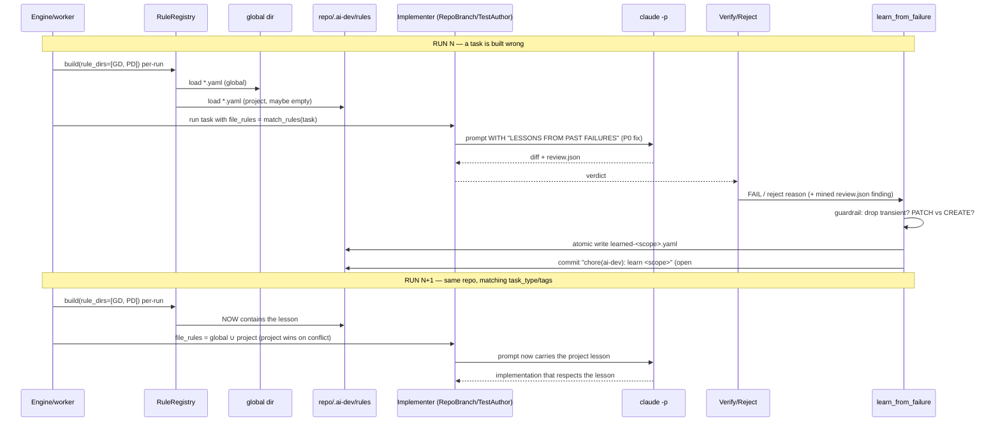

# Per-Project Personalized Learning — Design

> **Status:** design draft 2026-06-29, awaiting review.
> **Synthesizes:** (1) the NousResearch Hermes-agent analysis (which learning-loop mechanisms are
> worth borrowing) + (2) the per-project two-tier decision (global + per-project, lessons committed
> inside the target repo) confirmed with the user 2026-06-29.
> **Scope (this spec):** the failure-learning loop only. Make learned lessons **two-tier**
> (global + per-project) and store per-project lessons **inside the target repo**, then close the
> three broken links that make today's loop ineffective. Event/trajectory persistence and
> task-failure classification (the other two Hermes focus areas) are referenced as **sequenced
> follow-ups**, not built here.

## Problem

The failure-learning loop exists but is **global and effectively open on the primary path**. Four
concrete defects, all verified against current code:

1. **Global only — no project dimension.** `learn_from_failure` scopes lessons solely by
   `task_type`/`tags` ([`learning.py:126`](../../../src/ai_dev_system/rules/learning.py) —
   `_compute_scope`) and writes them into the **installed package directory**
   ([`learning.py:260`](../../../src/ai_dev_system/rules/learning.py) `rule_path`,
   default dir [`worker.py:23`](../../../src/ai_dev_system/engine/worker.py)
   `_RULES_DIR = .../rules/definitions`). A lesson minted on Project A is injected into Project B.
   There is no per-project memory.
2. **Open loop on the real executor (the critical defect).** `worker_loop` matches rules, passes
   `file_rules` to the agent, and emits `RULES_APPLIED`
   ([`worker.py:170`](../../../src/ai_dev_system/engine/worker.py)`-185`) — **but** the production
   agents on the TDD-first `claude -p` path **accept `file_rules` and drop it**:
   [`repo_branch_agent.py:322`](../../../src/ai_dev_system/agents/repo_branch_agent.py) and
   [`test_author_agent.py:127`](../../../src/ai_dev_system/agents/test_author_agent.py) never
   reference the parameter. Only [`claude_max_agent.py:108`](../../../src/ai_dev_system/agents/claude_max_agent.py)
   and `crewai_agent.py:87` inject it. So the learned YAML grows and `RULES_APPLIED` fires, but the
   lesson **never enters the implementer's prompt**. *(verified: `file_rules` appears exactly once —
   the signature — in both files.)*
3. **Stale within a run.** `RuleRegistry` is constructed once at module import
   ([`worker.py:24`](../../../src/ai_dev_system/engine/worker.py)
   `_rule_registry = RuleRegistry(...)`), so a lesson minted during a run only takes effect in the
   **next process** — sibling/downstream tasks in the same run never see it.
4. **Thin, rot-prone lesson source.** Lessons come only from FAIL-criterion reasoning or a free-text
   reject reason. `review.json` is written every run
   ([`repo_branch_agent.py:429`](../../../src/ai_dev_system/agents/repo_branch_agent.py)) but
   **never mined**. And because FAIL text is mined verbatim, a one-off **environmental** failure can
   harden into a permanent rule injected into every future matching task — the *"harden into
   refusals"* failure mode Hermes explicitly guards against.

## Principle

**Two tiers, separated by location.** Universal lessons stay **global** and ship with the tool;
project-specific lessons live **inside the target repo** at `<repo>/.ai-dev/rules/`, are
**committed**, and are **reviewed by the human in the PR** — the same human-as-approver gate the
pipeline already uses. Because "which project" is encoded by *where the file lives*, no schema or
match-logic change is needed. Borrow Hermes' hard-won **anti-rot guardrails** (DO-NOT-SAVE,
PATCH-before-CREATE) so per-project memory cannot poison itself.

This mirrors Hermes' own split: **bundled skills** (global, protected) + **agent-created skills**
(per-context, curated). The directory *is* the scope.

## Key decisions (locked / proposed)

| # | Decision | Choice | Source |
|---|----------|--------|--------|
| 1 | Isolation model | **Two-tier** (global + per-project), one install | user-confirmed |
| 2 | Where per-project lessons live | **Inside target repo** `<repo>/.ai-dev/rules/`, committed | user-confirmed |
| 3 | Scope mechanism | **Directory-based** — tier = file location; no `applies_to`/DB change | locked |
| 4 | Precedence on overlap | Project **augments** global; on direct conflict, **project wins** (more specific) | locked |
| 5 | Physical key vs logical key | Physical = `repo_root` (where `.ai-dev/` lives); logical = existing `project_id` (events/runs) | locked |
| 6 | How lessons enter git | **Separate commit** `chore(ai-dev): learn <scope>`, surfaced in the PR for human review | **proposed — open #1** |
| 7 | Auto-promotion project→global | **Deferred** (manual at first); revisit when a lesson recurs across ≥N projects | **proposed — open #2** |
| 8 | Default destination for new auto-lessons | **Project tier**; global "learned" only via promotion | **proposed — open #3** |

## Architecture

### Storage layout

```
[GLOBAL TIER]  — ships with the tool, applies to EVERY project
  src/ai_dev_system/rules/definitions/
    ├── tdd.yaml  security.yaml  code-review.yaml     (hand-authored, unchanged)
    └── learned-*.yaml                                 (only promoted/universal lessons)

[PROJECT TIER] — lives in the target repo, committed, reviewed in PR
  <target-repo>/.ai-dev/rules/
    ├── learned-<scope>.yaml      (lessons learned from THIS project's runs)
    └── README.md                 (one-paragraph explainer for the team)
```

Both tiers use the **same** YAML shape and the **same** `task_type`/`tags` matching — the only new
axis is *which directory* a rule came from.

### Two-tier RuleRegistry (per-run, layered)

`RuleRegistry` changes from "one dir, built at import" to "**ordered list of dirs, built per run**":

```
RuleRegistry(rule_dirs=[GLOBAL_DIR, <repo>/.ai-dev/rules])   # order = precedence (last wins)
  └── _load_rules(): glob *.yaml in EACH dir, tag each rule with its tier
  └── match_rules(task): union of matches across tiers; project rules appended AFTER global
```

- Construction moves **out of module import** ([`worker.py:24`](../../../src/ai_dev_system/engine/worker.py))
  into the task-execution path where the `repo_root` is known — this **also fixes defect #3**
  (intra-run staleness): a fresh registry per run picks up lessons minted by the previous run, and
  re-loading per task pickup (cheap — a handful of small YAMLs) lets task N+1 see task N's lesson.
- Missing `<repo>/.ai-dev/rules` → project tier is simply empty (graceful; global still applies).

### Three data flows

| Flow | Today | After |
|------|-------|-------|
| **MATCH** (read) | one dir, import-time singleton ([`worker.py:24`,`:170`](../../../src/ai_dev_system/engine/worker.py)) | per-run registry over `[global, project]`, unioned |
| **LEARN** (write) | caller passes `_RULES_DEFS_DIR` (package dir) to `learn_from_failure` ([`pipeline.py:159,188`](../../../src/ai_dev_system/verification/pipeline.py), [`webui.py:117`](../../../src/ai_dev_system/webui.py)) | caller passes `<repo>/.ai-dev/rules`; **the `rules_dir` param already exists** ([`learning.py:201`](../../../src/ai_dev_system/rules/learning.py)) — only the *value* changes |
| **INJECT** (use) | `RepoBranchAgent`/`TestAuthorAgent` drop `file_rules` 🔴 | both inject a `LESSONS FROM PAST FAILURES` block, as `ClaudeMaxAgent` already does |

## Components

### 1. `file_rules` injection — **P0 prerequisite** (modified: `RepoBranchAgent`, `TestAuthorAgent`)
Inject `file_rules` into the execution prompt under a dedicated header, copying the pattern in
[`claude_max_agent.py:108`](../../../src/ai_dev_system/agents/claude_max_agent.py)`-112`
(`"Project rules to honour: …"`). For the TDD path, add a
`"LESSONS FROM PAST FAILURES (apply these):"` section to `_build_execution_prompt` /
the test-author prompt. **Without this, nothing else in this spec has any effect.**

### 2. `RuleRegistry` — two-tier, per-run (modified: [`registry.py`](../../../src/ai_dev_system/rules/registry.py), [`worker.py`](../../../src/ai_dev_system/engine/worker.py))
- Accept `rule_dirs: list[Path]` (back-compat: a single `rules_dir` still works → `[rules_dir]`).
- `_load_rules` iterates all dirs, glob `*.yaml`, tag each `LearnedRule`/rule with `tier`.
- `match_rules` unions; project matches appended last (decision #4).
- Move construction into the run path with `repo_root` available; drop the import-time singleton.

### 3. `learn_from_failure` routing (modified callers, not the function)
The function already takes `rules_dir` ([`learning.py:201`](../../../src/ai_dev_system/rules/learning.py)).
Change the two call sites to pass the **project** dir:
- [`verification/pipeline.py:159,188`](../../../src/ai_dev_system/verification/pipeline.py) — resolve
  `<repo>/.ai-dev/rules` from run/context instead of `_RULES_DEFS_DIR`.
- [`webui.py:117`](../../../src/ai_dev_system/webui.py) — same, from the run's repo.
Atomic write + idempotent dedup ([`learning.py:168`,`182`](../../../src/ai_dev_system/rules/learning.py))
are reused verbatim; `rules_dir.mkdir(parents=True)` ([`learning.py:319`](../../../src/ai_dev_system/rules/learning.py))
already bootstraps the dir.

### 4. Lesson-synthesis guardrail — **anti-rot** (modified: lesson extraction in [`learning.py`](../../../src/ai_dev_system/rules/learning.py))
Borrow Hermes' authoring policy into the text that becomes a lesson:
- **DO-NOT-SAVE:** never capture transient/environment-dependent failures (flaky network, missing
  local binary, "tool X is broken") — these "harden into self-citing refusals."
- **Capture the FIX, not the failure:** phrase lessons as a corrective *action* ("ensure migrations
  run before integration tests") not a symptom ("tests failed").
- **PATCH-before-CREATE:** before appending a new lesson, check for a near-duplicate in the target
  tier and refine it instead of accreting a second near-identical entry (extends the current
  exact-string `_merge_unique`).
Implementation = prompt/policy text + a similarity check; no new infrastructure.

### 5. `review.json` mining (new lesson source, low cost)
`review.json` is already written ([`repo_branch_agent.py:429`](../../../src/ai_dev_system/agents/repo_branch_agent.py)).
After a task reaches a terminal state, mine each reviewer finding that was **auto-fixed during the
review-repair rounds** — a finding the implementer got wrong and had to correct is a recurring
mistake worth a project lesson. Feed it through the same guardrail (#4) and write path (#3). This
widens the source beyond FAIL-only **without new infrastructure**.

### 6. `repo_root` resolution + `.ai-dev` bootstrap
- `repo_root` is already held by `RepoBranchAgent`
  ([`repo_branch_agent.py:303`](../../../src/ai_dev_system/agents/repo_branch_agent.py)) and the
  single-task executor ([`single_task_executor.py:253`](../../../src/ai_dev_system/task_graph/single_task_executor.py)
  `repo_path = spec.get("repo")`). Thread it to the learn + match call sites.
- First run on a repo creates `<repo>/.ai-dev/rules/` + a short `README.md`.
- `project_id` (deterministic UUID5 of the slug, already in `runs.project_id`) remains the **logical**
  key for events; the **physical** lesson store is keyed by `repo_root`.

## Configuration / safety

- `AI_DEV_PROJECT_RULES` (default **on**) — enables the project tier. **Off** → single global tier =
  exact current behaviour (safe rollback), following the existing `EXEC_*`/`AI_DEV_*` env-flag
  convention.
- `AI_DEV_GLOBAL_RULES_DIR` (optional override) — for tests / non-default installs.
- **Back-compat:** existing `rules/definitions/learned-*.yaml` files become the **global tier**
  unchanged — **no data loss, no migration**. New auto-lessons go to the project tier going forward.
- **Security:** lessons in the target repo are model-written text injected into a future prompt.
  Reuse the guardrail (#4) and treat the project tier as the lower-trust tier; the human PR review
  is the backstop.

## Failure modes

| Situation | Behaviour |
|-----------|-----------|
| Target repo has no `.ai-dev/rules/` | Project tier empty; global tier still applies; dir created on first lesson |
| `AI_DEV_PROJECT_RULES=off` | Falls back to today's single global tier (verbatim current behaviour) |
| Project lesson contradicts a global one | Project wins (decision #4); both visible in the registry for debugging |
| Transient/env failure tries to mint a lesson | Guardrail (#4) drops it — not persisted |
| `repo_root` unresolved (e.g. adhoc spec without repo) | Skip project tier, log it, learn into global as today (no crash) |
| Two runs write the same project lesson | `_merge_unique` dedups; no duplicate, no write |
| Lesson YAML half-written / corrupt | Atomic temp+rename ([`learning.py:168`](../../../src/ai_dev_system/rules/learning.py)); loader skips unreadable files |

## Testing this change

- **Unit:**
  - `RepoBranchAgent` / `TestAuthorAgent` prompt contains the injected lesson text when `file_rules`
    is non-empty (directly asserts defect #2 is closed).
  - `RuleRegistry(rule_dirs=[g, p])` returns the union; project rule appended after global; conflict
    → project wins.
  - `learn_from_failure(rules_dir=<project>)` writes under the project dir, not the package dir.
  - Guardrail drops a transient/"tool broken" lesson; PATCH-before-CREATE refines instead of
    appending a near-duplicate.
- **Integration:**
  - Two sequential runs on a temp git repo (claude mocked): run 1 fails a criterion → lesson written
    to `<repo>/.ai-dev/rules/` and committed; run 2 → the lesson text appears in the prompt handed to
    `_invoke_claude` on the TDD path. End-to-end proof the loop is **closed**.

## Sequence — learn on run N, apply on run N+1 (same project)

### Mermaid



### ASCII fallback

```
        Engine   RuleReg   global   proj/.ai-dev   Impl    claude   Verify   learn
          │         │         │          │           │        │        │        │
==== RUN N : built wrong ===================================================================
          ├ build(rule_dirs=[global, proj]) per-run ─>│       │        │        │
          │         ├── load global *.yaml ──────────>│        │        │        │
          │         ├── load project *.yaml (empty) ─>│        │        │        │
          ├ run task, file_rules = match_rules(task) ──────────>│      │        │
          │         │         │          │           ├ prompt WITH lessons (P0) >│
          │         │         │          │           │<── diff + review.json ────┤
          │         │         │          │           ├──── verdict ─────>│        │
          │         │         │          │           │        │  FAIL/reject ────>│
          │         │         │          │           │        │        │  guardrail: drop transient? patch?
          │         │         │          ├<─ atomic write learned-<scope>.yaml ───┤
          │         │         │          ├<─ commit "chore(ai-dev): learn ..." (open #1)
============================================================================================
==== RUN N+1 : same repo, matching task ====================================================
          ├ build(rule_dirs=[global, proj]) per-run ─>│        │        │        │
          │         ├── load project *.yaml (HAS lesson now) ─>│        │        │
          ├ file_rules = global ∪ project (project wins) ──────>│       │        │
          │         │         │          │           ├ prompt carries project lesson ─>│
          │         │         │          │           │<── impl respects the lesson ────┤
============================================================================================
```

## Out of scope — sequenced follow-ups (the rest of the Hermes synthesis)

These came out of the Hermes analysis and **enable richer learning**, but are deliberately separate
specs so this one stays shippable:

1. **Task-failure classification** (Hermes `error_classifier`). Today `worker.py` marks all agent
   failures `EXECUTION_ERROR` — the one class the learning loop ignores
   ([`learning.py`](../../../src/ai_dev_system/rules/learning.py) selectivity). A small
   `classify_task_failure → {infra_transient, max_turns, built_wrong, env_misconfig}` with a
   `should_learn` hint would let "built wrong as a thrown exception" mint a lesson. **Companion to
   this spec** — improves *what* gets learned.
2. **Trajectory/event persistence** (Hermes `messages` table + `correlation_id`). Persist the
   `claude -p` NDJSON as structured rows and populate the already-existing `correlation_id` column
   ([`migrator.py:124`](../../../src/ai_dev_system/db/migrator.py); `EventRepo.insert` lacks the
   param — [`events.py:14`](../../../src/ai_dev_system/db/repos/events.py)). Unlocks mining lessons
   from the full trajectory, not just `review.json`.
3. **Verify→fix evidence ledger** (Hermes `verification_evidence`). Per-task passing-test evidence
   before "done" — a self-correction spec, orthogonal to learning.

## What this design does NOT change

- The Gate-3 verification pipeline's **judging logic** and the `learn_from_failure` core
  (extraction, scope, atomic write, dedup) — only *where the dir points* and *what text qualifies*.
- The `applies_to` schema and `RuleRegistry.match_rules` matching semantics (task_type/tags) — the
  tier is directory-based, not a new field.
- No DB schema change (no new column, no migration).
- No physical "one install per project" — a single install with per-project directories.
- Nothing from Hermes' chat surface (gateway, FTS5 self-search, Honcho) — out of scope by design.
