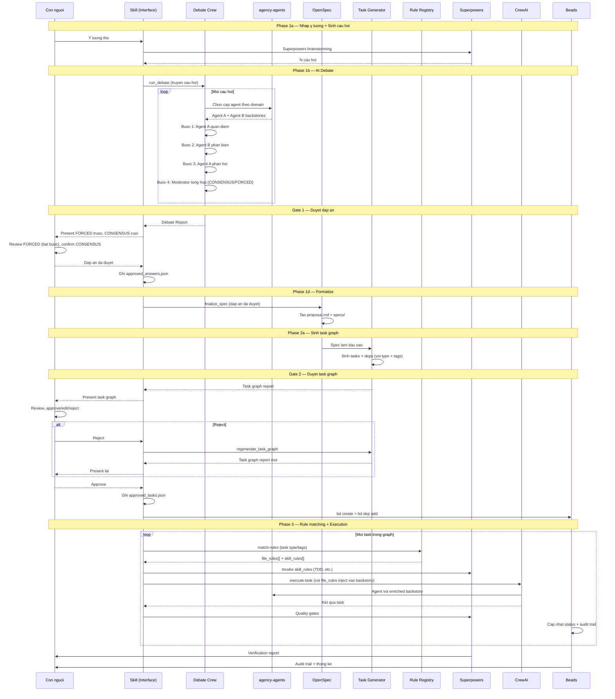

# Luồng làm việc v2: Human-as-Approver

## So sánh v1 vs v2

| | v1 (Human-in-the-Loop) | v2 (Human-as-Approver) |
|---|---|---|
| Brainstorming | Con người trả lời câu hỏi | AI debate, con người duyệt |
| Tạo task | Con người tự tay tạo | AI sinh, con người duyệt |
| Execution | AI thực thi | AI thực thi (giữ nguyên) |
| Quality check | AI kiểm tra | AI kiểm tra (giữ nguyên) |
| Con người làm | Trả lời + tạo task + review | Chỉ review và approve |

## Luồng mới

```
Con người nhập ý tưởng thô
    |
    v
[Skill: Superpowers brainstorming sinh câu hỏi]
    |
    v
[CrewAI Debate Crew]
    Mỗi câu hỏi -> 2 agent tranh luận (vòng lặp):
    Vòng 1:
      1. Agent A: quan điểm + ưu/nhược
      2. Agent B: phản biện + quan điểm riêng
    Vòng 2+:
      1. Agent A: tiếp thu + phản biện B + điều chỉnh
      2. Agent B: tiếp thu + phản biện A + điều chỉnh
    Moderator: kiểm tra đồng thuận → CONSENSUS hoặc FORCED
    |
    v
[GATE 1: Con người duyệt debate report]
    - CONSENSUS: 1-click confirm
    - FORCED: bắt buộc quyết định
    |
    v
[OpenSpec formalize spec từ đáp án đã duyệt]
    |
    v
[CrewAI Task Graph Generator]
    - Đọc spec -> sinh tasks + dependencies
    |
    v
[GATE 2: Con người duyệt task graph]
    - Approve / Thêm task / Sửa dependency / Reject
    |
    |-- Reject --> [regenerate_task_graph] --> quay lại GATE 2
    |
    v (Approve)
[Rule Registry: match rules theo task type/tags]
    - File rules → inject vào agent backstory
    - Skill rules → Skill invoke trước execution
    |
    v
[CrewAI + agency-agents thực thi (với rules đã inject)]
    |
    v
[Superpowers verification]
    |
    v
[Beads audit trail + report]
```

---

## Ví dụ: Forum chia sẻ kiến thức

### Phase 1a: Nhập ý tưởng

```
Con người: "Xây forum chia sẻ kiến thức nội bộ công ty"
```

### Phase 1b: AI Debate

Hệ thống sinh 8 câu hỏi brainstorming, mỗi câu được 2 agent tranh luận:

| Câu hỏi | Agent A | Agent B | Status |
|---|---|---|---|
| Feature chính MVP? | Product Manager | Backend Architect | CONSENSUS (2 vòng) |
| Primary users? | Product Manager | Backend Architect | CONSENSUS (1 vòng) |
| Backend tech stack? | Backend Architect | DevOps Specialist | CONSENSUS (3 vòng) |
| Frontend framework? | Backend Architect | DevOps Specialist | CONSENSUS (2 vòng) |
| Database schema? | Database Specialist | Backend Architect | CONSENSUS (2 vòng) |
| Authentication? | Security Specialist | Product Manager | FORCED (5 vòng) |
| API endpoints? | Backend Architect | DevOps Specialist | CONSENSUS (2 vòng) |
| Testing strategy? | QA Engineer | Backend Architect | CONSENSUS (3 vòng) |

### Phase 1c: Gate 1 — Duyệt đáp án

Con người nhận Debate Report:

```markdown
## Cần bạn quyết định (FORCED)
Q6: "Authentication?" — 5 vòng tranh luận vẫn bất đồng
  Security Specialist: OAuth2 + JWT (stateless, scale tốt)
  Product Manager: Session + Redis (đơn giản, revoke ngay)
  Moderator chốt: OAuth2 + JWT + short expiry (cả 2 thấy hợp lý)
  → [x] Đồng ý moderator

## Đã đồng thuận (CONSENSUS) — confirm nhanh
Q1-Q2, Q4-Q5, Q7: Đã đồng thuận
  → [x] OK tất cả
```

### Phase 2: Task Graph tự động

Sau khi duyệt, hệ thống tự sinh task graph:

```
TASK-1: Thiết kế PostgreSQL schema (ready)
TASK-2: Setup OAuth2 + JWT (blocked by TASK-1)
TASK-3: API endpoints FastAPI (blocked by TASK-1, TASK-2)
TASK-4: React + TypeScript setup (blocked by TASK-3)
TASK-5: UI components (blocked by TASK-4)
TASK-6: Testing + QA (blocked by TASK-3, TASK-5)
```

Con người duyệt: **Approve** (hoặc sửa trước khi approve)

### Phase 3-5: Execution (giữ nguyên)

CrewAI + agency-agents thực thi tuần tự theo dependency graph.
Superpowers kiểm tra (TDD, code review, verification).
Beads lưu audit trail.

---

## Sequence Diagram



---

---

## Thiết kế Conversation Flow: Gate 1 (Skill)

Gate 1 chạy trong Claude Code Skill — không phải terminal `input()`. Skill dẫn dắt user qua 4 state tuần tự.

### State Machine

```
[PRESENT] → [COLLECT_FORCED] → [COLLECT_CONSENSUS] → [CONFIRM] → [DONE]
                                                           ↑           |
                                                           └───────────┘
                                                         (nếu user muốn sửa)
```

---

### State 1: PRESENT

Skill hiển thị debate report (markdown), rồi gửi **một message duy nhất** tóm tắt:

```
📋 Debate hoàn tất. 8 câu hỏi đã được debate.

❗ CẦN QUYẾT ĐỊNH (1 câu):
  Q6: Authentication — 5 vòng bất đồng
    • Security: OAuth2 + JWT (stateless, scale tốt)
    • Product: Session + Redis (đơn giản, revoke ngay)
    • Moderator đề xuất: OAuth2 + JWT + short expiry

✅ ĐÃ ĐỒNG THUẬN (7 câu): Q1, Q2, Q3, Q4, Q5, Q7, Q8

→ Quyết định Q6 để tiếp tục (hoặc "xem Q3" để xem chi tiết câu nào).
```

**Nguyên tắc:** Không hỏi từng câu một. Trình bày toàn bộ picture ngay.

---

### State 2: COLLECT_FORCED

Skill track `{ "Q6": None }` — chờ user điền. Chấp nhận mọi dạng input:

| User nói | Skill parse thành |
|----------|-------------------|
| `"Q6 đồng ý moderator"` | `Q6: APPROVED_MODERATOR` |
| `"Q6: JWT + Redis"` | `Q6: OVERRIDE("JWT + Redis")` |
| `"chọn option A cho Q6"` | `Q6: APPROVED_AGENT_A` |
| `"Q6 dùng Clerk.dev"` | `Q6: OVERRIDE("Clerk.dev")` |

Nếu parse ambiguous → clarify ngay (không để sai đi vào spec):
```
Bạn muốn dùng Clerk.dev cho authentication — hiểu đúng chưa?
```

Nếu còn FORCED chưa quyết định → nhắc nhẹ sau mỗi message của user:
```
Còn Q6 chưa quyết định. Bạn chọn gì?
```

**Chặn:** Nếu user nói `"approve all"` khi còn FORCED → Skill từ chối, giải thích FORCED không thể skip.

---

### State 3: COLLECT_CONSENSUS

Sau khi FORCED xong, hỏi một lần:

```
7 câu còn lại đã đồng thuận. Approve tất cả, hay muốn xem/sửa câu nào?
```

| User nói | Hành động |
|----------|-----------|
| `"approve all"` / `"ok hết"` | Mark tất cả `APPROVED_CONSENSUS`, sang CONFIRM |
| `"xem Q3"` | Show Q3 detail, hỏi quyết định, loop |
| `"approve all, Q4 dùng Vue thay React"` | Parse batch: Q4 → OVERRIDE, còn lại → APPROVED_CONSENSUS |

---

### State 4: CONFIRM

Skill show structured summary của toàn bộ 8 quyết định:

```
📝 Tóm tắt quyết định:

Q1 Feature MVP         → ✅ Consensus (forum + search + tags)
Q2 Primary users       → ✅ Consensus (internal developers)
Q3 Backend stack       → ✅ Consensus (FastAPI + PostgreSQL)
Q4 Frontend            → ✏️  Override: Vue.js (thay React)
Q5 Database schema     → ✅ Consensus (users/posts/tags)
Q6 Authentication      → ✏️  Approve moderator: OAuth2 + JWT
Q7 API endpoints       → ✅ Consensus (REST + OpenAPI)
Q8 Testing             → ✅ Consensus (pytest + Playwright)

Xác nhận để tiếp tục? (hoặc "sửa Q4" nếu muốn thay đổi)
```

- `"ok"` / `"xác nhận"` → Skill ghi `approved_answers.json`, gọi `finalize_spec`
- `"sửa Q4"` → quay về COLLECT_CONSENSUS cho Q4, re-CONFIRM

---

### Nguyên tắc thiết kế

| Nguyên tắc | Lý do |
|-----------|-------|
| Không hỏi từng câu một | Bị interrupt 8 lần = mất tập trung |
| Batch input được phép | Giữ triết lý Human-as-Approver |
| CONFIRM bắt buộc | Safety net trước `finalize_spec` (không undo được) |
| Ambiguous → clarify ngay | Không để sai đi sâu vào spec |
| FORCED trước CONSENSUS | Ưu tiên cái quan trọng trước |

### Edge Cases

1. **Skip FORCED** — `"approve all"` khi còn FORCED → Skill chặn, nhắc rõ
2. **Override mâu thuẫn nội bộ** — Skill flag cảnh báo, không chặn (user tự quyết)
3. **Đổi ý sau CONFIRM** — Skill cảnh báo đã gọi `finalize_spec`, hỏi có muốn `regenerate_task_graph` không

---

## Thay đổi so với v1

### Thêm mới

1. **Debate Crew** — cơ chế tranh luận vòng lặp đối xứng (tối đa 5 vòng)
2. **Agent Pairing** — ghép cặp agent đối lập theo domain câu hỏi
3. **Status Scoring** — CONSENSUS/FORCED để con người biết tập trung vào đâu
4. **Approval Gate 1** — duyệt đáp án debate
5. **Approval Gate 2** — duyệt task graph
6. **Task Graph Generator** — tự động sinh tasks và dependencies

### Giữ nguyên

- Phase 3: CrewAI + agency-agents execution
- Phase 4: Superpowers quality gates (TDD, code review, verification)
- Phase 5: Beads audit trail + reporting
- Toàn bộ cơ chế memory (LanceDB, Dolt, files)

### Con người chỉ cần làm

| Trước (v1) | Sau (v2) |
|---|---|
| Trả lời 8+ câu hỏi brainstorming | Duyệt report, chỉ quyết định FORCED items |
| Chạy `bd create` cho từng task | 1-click approve task graph |
| Chạy `bd dep add` cho từng dependency | Sửa nếu cần, approve |
| Tổng thời gian: 30-60 phút | Tổng thời gian: 5-10 phút |
