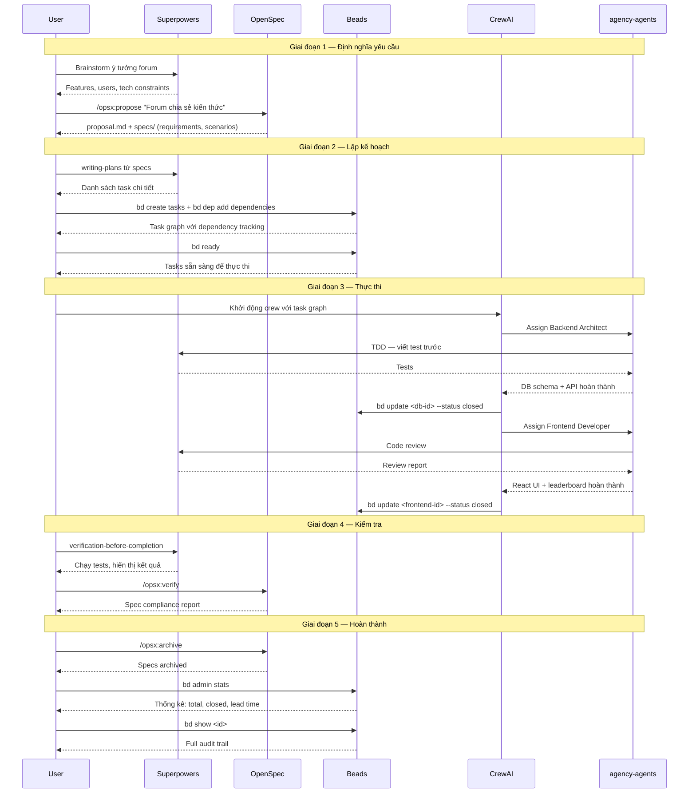

# Luồng làm việc End-to-End

## Giới thiệu

Tài liệu này mô tả luồng làm việc hoàn chỉnh sử dụng cả 5 component trong hệ thống: **OpenSpec**, **Superpowers**, **Beads**, **CrewAI**, và **agency-agents**. Để minh họa cụ thể, chúng ta sẽ đi qua một ví dụ thực tế: **"Xây forum chia sẻ kiến thức cho công ty"** — một internal knowledge-sharing forum có contributor leaderboard.

---

## Ví dụ: Forum chia sẻ kiến thức

### Giai đoạn 1: Định nghĩa yêu cầu (OpenSpec + Superpowers)

Bắt đầu bằng việc khám phá ý tưởng với **Superpowers brainstorming skill**:

- Những feature nào cần có? Posts, comments, voting, leaderboard, categories
- Ai là user? Toàn bộ nhân viên công ty
- Ràng buộc về tech stack? React frontend, Node.js backend, PostgreSQL

Sau khi brainstorm xong, **OpenSpec** formalize yêu cầu thành spec chính thức:

```bash
/opsx:propose "Forum chia sẻ kiến thức"
```

**Output** gồm `proposal.md` và thư mục `specs/` chứa các requirement:

- "Hệ thống MUST cho phép đăng bài với tiêu đề và nội dung"
- "Hệ thống MUST hiển thị bảng xếp hạng top contributors"
- "Hệ thống MUST hỗ trợ voting (upvote/downvote) cho mỗi bài đăng"
- "Hệ thống MUST phân loại bài đăng theo categories"

Mỗi requirement đi kèm scenario ở định dạng **Given/When/Then**:

```gherkin
Given một nhân viên đã đăng nhập
When họ tạo bài đăng mới với tiêu đề và nội dung
Then bài đăng xuất hiện trong danh sách và contributor score tăng 1 điểm
```

### Giai đoạn 2: Lập kế hoạch (Beads + Superpowers)

**Superpowers writing-plans** tạo danh sách task chi tiết dựa trên spec từ giai đoạn 1.

**Beads** chuyển danh sách đó thành task graph có thể track được:

```bash
bd create "Thiết kế DB schema" --type task --priority high
bd create "API endpoints" --type task
bd create "React frontend" --type task
bd dep add <api-id> blocks <frontend-id>
bd dep add <db-id> blocks <api-id>
```

Kiểm tra task nào sẵn sàng để bắt tay vào làm:

```bash
bd ready
```

Kết quả: **DB schema** là task duy nhất ở trạng thái ready — vì API phụ thuộc vào DB, và frontend phụ thuộc vào API.

### Giai đoạn 3: Thực thi (CrewAI + agency-agents + Superpowers)

**CrewAI** orchestrate các agent thực thi tuần tự theo dependency graph:

**Agent 1: Backend Architect** (từ agency-agents)

- **Task:** Thiết kế DB schema + API dựa trên OpenSpec specs
- **Superpowers:** TDD — viết test trước, rồi mới implement
- Khi hoàn thành:

```bash
bd update <db-id> --status closed
```

**Agent 2: Frontend Developer** (từ agency-agents)

- **Task:** Xây React UI + leaderboard component
- **Superpowers:** Code review sau khi implement xong
- Khi hoàn thành:

```bash
bd update <frontend-id> --status closed
```

Mỗi bước đều tuân theo quy trình: **implement → test → review → verify → close task** trong Beads.

### Giai đoạn 4: Kiểm tra (Superpowers + OpenSpec)

**Superpowers verification-before-completion** đảm bảo mọi thứ đúng trước khi tuyên bố hoàn thành:

1. Chạy toàn bộ test suite, hiển thị output
2. Đối chiếu với OpenSpec specs: mọi requirement đều có test pass?
3. Validate implementation khớp với spec:

```bash
/opsx:verify
```

Nếu có requirement chưa được cover hoặc test fail, quay lại giai đoạn 3 để fix.

### Giai đoạn 5: Hoàn thành (Beads + OpenSpec)

Archive và tổng kết:

```bash
# Merge specs vào source of truth, chuyển sang archive
/opsx:archive

# Xem thống kê tổng quan
bd admin stats
# Output: total tasks, closed tasks, average lead time

# Xem audit trail đầy đủ cho bất kỳ task nào
bd show <id>
```

Toàn bộ công việc được **documented và traceable** — từ requirement ban đầu đến implementation cuối cùng.

---

## Sequence Diagram



---

## Output mong đợi mỗi giai đoạn

| Giai đoạn | Công cụ | Output |
|---|---|---|
| 1 — Định nghĩa yêu cầu | OpenSpec + Superpowers | `proposal.md`, `specs/` (requirements + scenarios), `design.md`, `tasks.md` |
| 2 — Lập kế hoạch | Beads + Superpowers | Task graph với dependencies, implementation plan chi tiết |
| 3 — Thực thi | CrewAI + agency-agents + Superpowers | Source code, tests, review reports |
| 4 — Kiểm tra | Superpowers + OpenSpec | Verification report, spec compliance check |
| 5 — Hoàn thành | Beads + OpenSpec | Audit trail, statistics, archived specs |
