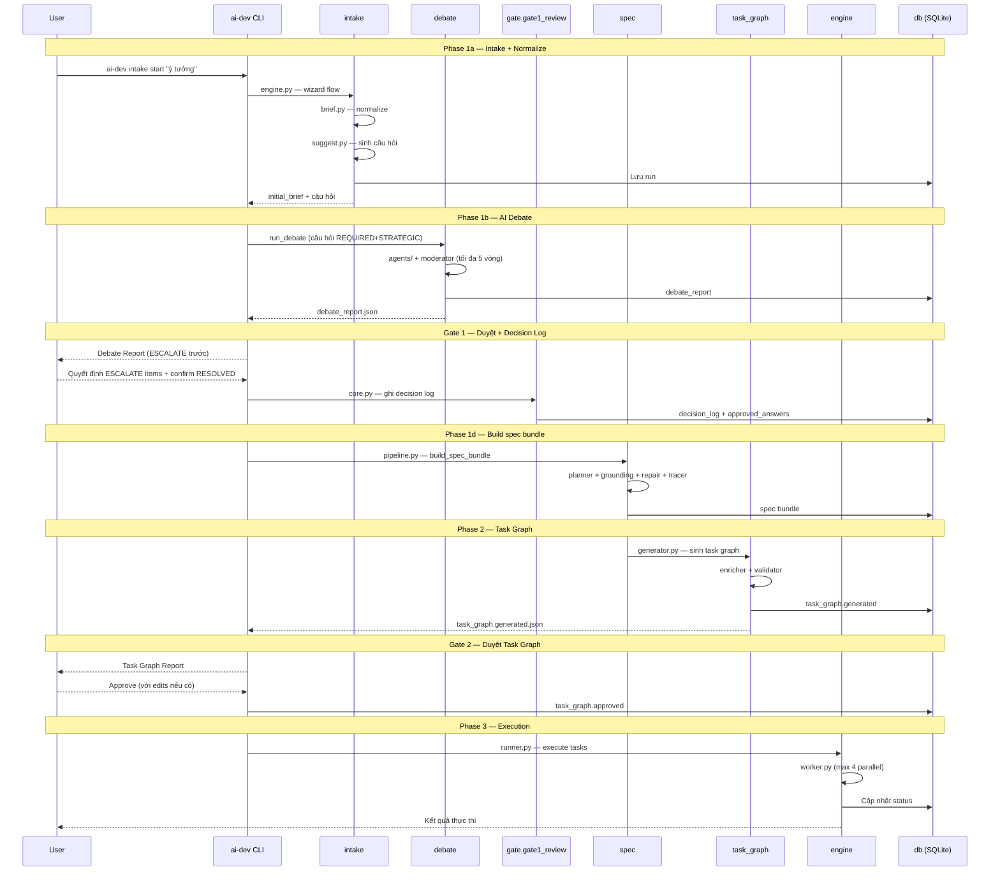

# Luồng làm việc End-to-End

## Giới thiệu

Tài liệu này mô tả luồng làm việc hoàn chỉnh của AI Development System — một Python monorepo với các module: `intake`, `debate`, `gate.gate1_review`, `spec`, `task_graph`, và `engine`. Người dùng chỉ can thiệp tại 2 approval gate.

Để minh họa cụ thể, chúng ta đi qua ví dụ: **"Xây forum chia sẻ kiến thức nội bộ"**.

---

## Ví dụ: Forum chia sẻ kiến thức

### Phase 1a: Intake + Normalize (`ai_dev_system.intake`)

Người dùng bắt đầu bằng lệnh:

```bash
ai-dev intake start "Xây forum chia sẻ kiến thức nội bộ công ty"
```

Module `intake.brief` normalize ý tưởng thô thành `initial_brief`:

```
Problem: Nhân viên không có nơi chia sẻ kiến thức
Users: Developers nội bộ
Success: Post/search bài viết, contributor leaderboard
Constraints: Internal only, auth bắt buộc
Unknowns: Scale? Real-time cần không?
```

Module `intake.suggest` sinh câu hỏi phân loại:

- `REQUIRED`: Feature MVP là gì? Primary users?
- `STRATEGIC`: Backend tech stack? Frontend framework? Authentication?
- `OPTIONAL`: Testing strategy? Notification?

### Phase 1b: AI Debate (`ai_dev_system.debate`)

Module `debate` cho từng câu hỏi REQUIRED + STRATEGIC:

| Câu hỏi | Loại | Status |
|---|---|---|
| Feature MVP? | REQUIRED | RESOLVED (2 vòng) |
| Primary users? | REQUIRED | RESOLVED (1 vòng) |
| Backend stack? | STRATEGIC | RESOLVED (3 vòng) |
| Authentication? | STRATEGIC | ESCALATE_TO_HUMAN (5 vòng) |
| Database schema? | STRATEGIC | RESOLVED (2 vòng) |

Kết quả: `debate_report.json` lưu vào SQLite.

### Gate 1: Duyệt debate report (`ai_dev_system.gate.gate1_review`)

Người dùng nhận report qua CLI, quyết định ESCALATE items trước:

```
❗ CẦN QUYẾT ĐỊNH:
  Authentication — 5 vòng, confidence 0.55
    • OAuth2 + JWT (stateless, scale tốt)
    • Session + Redis (đơn giản, revoke ngay)
    → Chọn: OAuth2 + JWT + short expiry

✅ ĐÃ RESOLVED: Approve tất cả
```

Module `gate1_review.core` ghi `decision_log.json` và `approved_answers.json` vào SQLite.

### Phase 1d: Build spec bundle (`ai_dev_system.spec`)

```bash
# Tự động sau Gate 1 approve
```

`spec.pipeline` → `spec.planner` sinh 5 artifact:
- `proposal.md` — tổng quan feature
- `design.md` — thiết kế kỹ thuật
- `functional.md` — yêu cầu chức năng
- `non-functional.md` — yêu cầu phi chức năng
- `acceptance-criteria.md` — tiêu chí nghiệm thu

`spec.grounding` kiểm tra spec với codebase thực tế.
`spec.repair` tự động sửa conflict.

### Phase 2: Task Graph Generator (`ai_dev_system.task_graph`)

`task_graph.generator` sinh tasks với metadata đầy đủ:

```
TASK-1: Thiết kế PostgreSQL schema
  agent_type: Database Specialist
  required_inputs: functional.md, non-functional.md
  expected_outputs: schema.sql, erd.md
  done_definition: Schema cover đủ entities trong spec

TASK-2: Setup OAuth2 + JWT (blocked by TASK-1)
TASK-3: API endpoints FastAPI (blocked by TASK-1, TASK-2)
TASK-4: React + TypeScript setup (blocked by TASK-3)
TASK-5: UI components (blocked by TASK-4)
TASK-6: Testing + QA (blocked by TASK-3, TASK-5)
```

### Gate 2: Duyệt task graph

Người dùng review và approve (hoặc sửa trước khi approve).
`task_graph.approved.json` lưu vào SQLite.

### Phase 3: Execution (`ai_dev_system.engine`)

> ⚠️ **Lưu ý:** Single-task execution đã hoạt động. Multi-task graph execution với required_inputs/promoted_outputs đang phát triển.

```bash
ai-dev phase-b run
```

`engine.runner` + `engine.worker` (max 4 parallel workers) thực thi theo dependency order.
`engine.failure` — retry tối đa 2 lần / task.
`engine.escalation` — escalate to human khi hết retry.

---

## Sequence Diagram



---

## Output mong đợi mỗi giai đoạn

| Giai đoạn | Module | Output |
|---|---|---|
| Intake + Normalize | `intake` | `initial_brief.json`, câu hỏi phân loại |
| AI Debate | `debate` | `debate_report.json` |
| Gate 1 | `gate.gate1_review` | `decision_log.json`, `approved_answers.json` |
| Spec bundle | `spec` | 5 artifact (proposal/design/functional/non-functional/acceptance-criteria) |
| Task Graph | `task_graph` | `task_graph.generated.json`, `task_graph.approved.json` |
| Execution | `engine` | Task results, audit trail trong SQLite |
